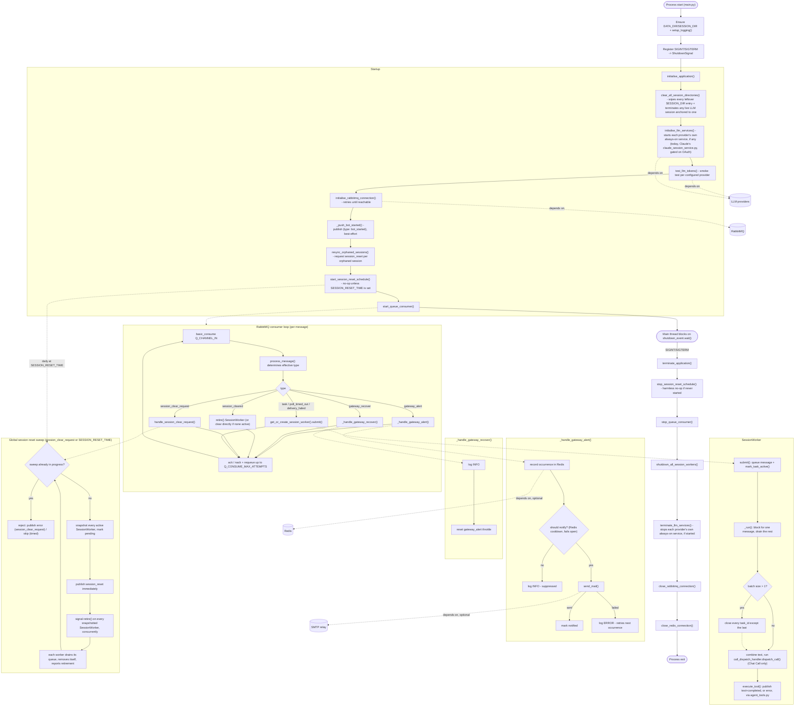

# Bot Sanctuary

Bot Sanctuary is the successor to `bot_orchestrator`'s routing role, merged with the AI agent pipeline itself - one consolidated Python application rather than a separate orchestrator container plus per-agent containers. It owns RabbitMQ consumption from `telegram_gateway`, per-session threading, the multi-agent "Call" pipeline, tool access, and error/alert routing. All application code runs inside a Docker container - there is no standalone execution path.

**Status:** RabbitMQ connectivity, SMTP alerting, and per-session message routing/coalescing are implemented. A minimal agent Call pipeline is now wired end-to-end (each `SessionWorker`'s coalesced turn is handed to the Chat Call, and its reply/error published back to `telegram_gateway` via `utils_agents/agent_tools.py`) - but it is Chat-only, with no handoff between Calls and no LLM-decided tool-calling yet. See `CODE_TODO.md` for current status and design.

## Infrastructure

Python application root is located at `bot_sanctuary/bot_sanctuary_application`.

- Python 3.12 (`python:3.12.4-slim` base image), run as a Docker container on the project's isolated bridge network.
- Depends on RabbitMQ for internal messaging.
- Four LLM providers are wired, each with its own credential pair: `claude` (Claude Agent SDK), `codex`/`deepseek`/`qwen` (direct REST call to each provider's own OpenAI-compatible endpoint). More than one can be configured at once. `claude` supports OAuth login via its own CLI, installed natively in the image; `codex`/`deepseek`/`qwen` are API-key-only - Codex's own OAuth path is not developed, see `CODE_TODO.md`.
- Optionally depends on an SMTP relay for `gateway_alert` alerting - inert until configured.
- Optionally depends on Redis for a durable, once-per-day throttle on `gateway_alert` notifications, and for crash-recovery task tracking - not a hard startup dependency.

### Project Structure

- `main.py` - application entry point; configures logging, registers shutdown signal handlers, and drives startup/shutdown.
- `config.py` - centralised, environment-driven application configuration.
- `utilities/initialise.py` - startup/shutdown orchestration.
- `utilities/logging_setup.py` - console and rotating file logging configuration.
- `utilities/utilities.py` - shared, dependency-free helpers.
- `utilities/utils_agents/` - `agent_interface.py::query_llm(llm_type, prompt)` dispatches to an explicitly-named provider, plus one `<provider>_interface.py` per provider.
- `utilities/utils_calls/` - the multi-agent "Call" model (Chat/Architect/Coder/Review/Documentation) and its handoff router.
- `utilities/utils_queue/` - RabbitMQ connection lifecycle and inbound message dispatch.
- `utilities/utils_smtp/` - SMTP send/test capability for alerting.
- `utilities/utils_redis/` - `gateway_alert` notification throttle and crash-recovery active-task tracking.
- `utilities/utils_session/` - the per-session worker registry (`SessionWorker`).
- `libraries/` - per-provider, per-Call persona files.
- `data/logs/` - runtime log output.

### Application Lifecycle

#### Startup

1. Ensure `DATA_DIR`/`SESSION_DIR` exist and configure logging.
2. Register `SIGINT`/`SIGTERM` handlers.
3. `initialise_application()` first clears every leftover on-disk session directory (and any live LLM session anchored to one) unconditionally - see `utils_session/session_worker.py::clear_all_session_directories()` - then starts every LLM provider's own always-on service, if it has one (today, only Claude's `claude_session_service.py`, and only if Claude is configured for OAuth access - see `utils_agents/agent_interface.py::initialise_llm_services()`), runs a startup LLM credential smoke test, opens the RabbitMQ consume connection (retrying indefinitely until reachable), publishes an unconditional `bot_started` event (`{"type": "bot_started"}`, no other fields - fired on every startup regardless of cause, crash or routine redeploy alike, so `telegram_gateway` can resolve any session_reset it's still holding for this application), runs the crash-recovery sweep, starts the optional daily timed session reset schedule (`SESSION_RESET_TIME`, if configured - see "Session Reset" under Environment Variables below), then starts the background consumer thread.
4. The main thread blocks until a shutdown signal is received.

#### Runtime

The RabbitMQ consumer loop consumes from `Q_CHANNEL_IN` and routes each message by its effective type:

- `gateway_alert` - logged critically, counted in Redis, and notified by email (throttled).
- `gateway_recover` - logged, clears the `gateway_alert` throttle.
- `session_cleared` - signals the corresponding `SessionWorker` to finish any in-flight turn and retire (removing itself from the registry, clearing its on-disk directory, and terminating any live LLM session anchored to it), or clears directly if no worker is currently active.
- `session_clear_request` - the admin-triggered request for a global session reset, accepted or rejected depending on whether a reset sweep is already in progress - see "Global Session Reset" below.
- Everything else (a task, `poll_timed_out`, `delivery_failed`) - routed to `get_or_create_session_worker(session_id)`.

A message is acked once successfully registered with its `SessionWorker`, not once actually processed. A failed registration (full inbox) is nacked and requeued.

Each `SessionWorker` is a long-lived, per-`session_id` thread with its own inbox and its own RabbitMQ publish connection. It coalesces whatever is already queued into one combined turn rather than firing one turn per message, closing out every task_id in a batch except the last immediately. The last task_id's combined text is then run through `utils_calls/turn_handler.py::run_turn()` (Chat Call only, no handoff yet) and the outcome published via `utils_agents/agent_tools.py::execute_tool()` - a reply as `text` followed by `completed`, a pipeline failure as `error`, and a reply that itself fails validation/publish falling back to `error` too, so a task_id is never left silently open.

Crash recovery: every accepted `task_id` is durably recorded in Redis and cleared once resolved - including the final task_id of a coalesced batch now that the pipeline above actually closes it out. At startup, before the consumer starts, any still-recorded tasks are grouped by session and a `session_reset` is requested per session.

#### Global Session Reset

Every session this application holds can be cleared in one of two ways: a whitelisted admin's `"${BOT_NAME} refresh yourself"` command in Telegram, relayed here as `session_clear_request`, or this application's own optional daily schedule (`SESSION_RESET_TIME`). Both share the same sweep, decided purely by whether an earlier sweep is still in progress - a `session_clear_request` arriving while one is running is rejected with an `error` reply so the requesting admin knows why nothing happened, while a conflicting scheduled trigger has no requester to notify and is simply skipped until its next daily occurrence.

On acceptance, `session_reset` is published to `telegram_gateway` immediately - before any session is actually cleared - so the reset takes effect on that side without waiting for every session here to finish its own graceful shutdown first. Every currently active `SessionWorker` is then signalled to retire: finish whatever is already queued, then permanently remove itself from the session registry and clear its on-disk directory. A further reset request is only accepted again once every signalled session has finished retiring.

Crash recovery for this feature relies on the unconditional `bot_started` broadcast rather than resuming an interrupted sweep - an in-progress sweep is purely in-memory state and is simply lost if the process restarts mid-sweep, with `telegram_gateway`'s own pending-reset ceiling acting as the eventual fallback.

#### Shutdown

1. Stop the timed session reset schedule, if it was ever started (harmless no-op otherwise).
2. Stop the RabbitMQ consumer.
3. Signal every active `SessionWorker` to finish its queued work, and wait for each (bounded by `SESSION_SHUTDOWN_TIMEOUT_SECONDS`).
4. Stop every LLM provider's own always-on service, if it was started - deliberately after every `SessionWorker` has finished, since a worker's last turn may still be mid-call against it.
5. Close the RabbitMQ connection.
6. Close the Redis connection, if it was ever opened.

## Getting Started

The Bot Sanctuary container is intended to be managed by the project's root `./setup.sh` script, run from the `server-ai-chatbot-setup` root directory, and is not typically invoked directly. A helper script, `setup.sh`, is also available for standalone `bot_sanctuary` development.

### First-Time Setup

Run the helper script and select option 1 to build and run the project:

```bash
./setup.sh
```

### Running the Project

Once built, use the same helper script for day-to-day container management:

```bash
./setup.sh
```

#### LLM Provider CLI Login

`claude` persists its login session to `bot_directory/claude` (bind-mounted, so a login survives a container recreation). `codex`/`deepseek`/`qwen` are API-key-only and need no login.

```bash
docker exec -it <container_name> claude setup-token
```

Copy the resulting Claude token into `config.ini`'s `CHATBOT_LLM_CLAUDE_TOKEN` and restart the container.

#### Testing SMTP Configuration

Once `SMTP_ENABLE_MAILER=true` and the other `SMTP_*` settings are configured, verify the configuration end-to-end:

```bash
docker exec <container_name> python -m bot_sanctuary_application.utilities.utils_smtp.smtp_handler
docker exec <container_name> python -m bot_sanctuary_application.utilities.utils_smtp.smtp_handler someone@example.com
```

Exits `0` on success, `1` on failure - check the container logs either way for details.

## Documentation

### Logging

- Logged to both the console and a rotating file at `bot_sanctuary_application/data/logs/bot_sanctuary.log`, rotated daily (or on reaching `LOG_MAX_SIZE_MB`), retained for `LOG_RETENTION_DAYS` days.
- Format: `%(asctime)s | %(levelname)s | %(name)s | %(message)s`.
- Verbosity is controlled by `LOG_LEVEL`.

| Level | Purpose |
|---------|---------|
| DEBUG | Detailed diagnostic information. |
| INFO | Normal application events. |
| WARNING | A recoverable issue, e.g. RabbitMQ not yet reachable at startup. |
| ERROR | A single operation failed and was dropped. |
| CRITICAL | A systemic failure requiring attention, e.g. a `gateway_alert` received. |

### Design Decisions

- Startup RabbitMQ connection retries indefinitely rather than crash-exiting, since the container may start before RabbitMQ is ready.
- Each `SessionWorker` owns its own RabbitMQ publish connection rather than sharing one, since a pika connection/channel is not thread-safe.
- SMTP credentials are never logged in full, only whether a value is set.
- Redis uses a separate ACL user from `telegram_gateway`, scoped to this application's own keys.
- The `gateway_alert` throttle fails open on a Redis outage, favouring alert availability over perfect throttling.
- `SessionWorker` has three stop paths: `stop()` abandons queued work immediately (currently unused, kept as a documented primitive), `shutdown()` drains it fully with no further action (used at application shutdown), and `retire()` drains it fully - including anything already in progress - and then permanently removes the session, clears its on-disk directory, and terminates any live LLM session anchored to it (used both by a global session reset and by a per-chat `session_cleared` confirmation).
- Every on-disk session directory is also cleared unconditionally on every `bot_sanctuary` startup (`clear_all_session_directories()`, the first step of `initialise_application()`), not only on an explicit reset.
- A session's on-disk directory is laid out `SESSION_DIR/<session_id>/<call_type>/<llm_type>` (e.g. `.../chat/claude`) - a stable root per `session_id`, with one leaf subdirectory per Call/LLM-provider combination actually used for it, rather than a single directory per session. This is what lets two different Calls (or the same LLM reused by two different Calls) each keep their own isolated Claude working-directory/session anchor for the same `session_id`, once handoff between Calls is wired (see `CODE_TODO.md`).
- A global session reset's accept/reject decision is a single in-memory flag - whether an earlier sweep is still draining - not a comparison against the requesting admin or request identity; any request arriving while one is in progress is rejected the same way regardless of who or what triggered it.
- All wall-clock timing - log timestamps, `SESSION_RESET_TIME` scheduling, throttle timestamps - is anchored to one configurable timezone (`TZ`) via a single shared time-retrieval helper, rather than each module reading the container's own local time independently.
- Claude's own credential (OAuth token or API key) is bridged into the SDK's expected environment variable exactly once, at startup, rather than resolved on every call.
- Claude's own session continuity uses an explicit `resume=<session_id>` marker captured from each call's own result, since `continue_conversation=True` was found empirically unreliable across separate SDK calls.
- `claude_session_service.py` maintains one persistent Claude client per generation directory, never pooled or shared across sessions, which is what guarantees prompt-cache isolation between different sessions.
- A Claude library file change is detected by re-parsing it fresh on every turn and comparing it against the client's own stored persona, reconnecting only on an actual change.

### Limitations

- The agent Call pipeline is Chat-only for now - no handoff between Calls, no whitelist/access-tier enforcement, and no LLM-decided tool-calling (a reply is always sent as plain "text", never chosen by the LLM itself from `utils_agents/agent_tools.py`'s tool set) - see `CODE_TODO.md`.
- `gateway_alert` notification is dispatched synchronously on the RabbitMQ consumer thread.
- The crash-recovery startup sweep still over-triggers for any task predating this pipeline (or from an application version that never wired it) - `mark_task_complete()` is now called for a coalesced batch's final task_id too, on every exit path that actually closes it out on `telegram_gateway`'s side, but this only takes effect going forward.
- The `gateway_alert` throttle window is a rolling cooldown, not a calendar-day reset.
- `qwen_interface.py`'s endpoint/model are unconfirmed assumptions, not verified against a real account.
- `codex_interface.py`'s accepted `reasoning_effort` values per model, and its previous_response_id-rejection detection, are unconfirmed against a real account.
- A failed `session_reset`/rejection publish during a global session reset has no retry or backstop - the requesting admin's task may be left open on `telegram_gateway`'s side.
- A session receiving a continuous, gapless stream of messages can delay its own retirement indefinitely during a global session reset, blocking every later reset request until it finishes.
- A call against Claude's persistent session platform that exceeds `AGENT_QUERY_TIMEOUT_SECONDS` is only best-effort cancelled - the abandoned call may continue running in the background, though the next call for that same session always builds a fresh client rather than queuing behind it.

### Environment Variables

#### Application / Logging

| Variable | Purpose |
|---------|---------|
| LOG_LEVEL | Root logger verbosity. |
| LOG_MAX_SIZE_MB | File size that triggers a log rotation, alongside the daily rotation. |
| LOG_RETENTION_DAYS | Number of rotated log files kept before deletion. |

#### Timezone

| Variable | Purpose |
|---------|---------|
| TZ | IANA timezone name (e.g. `Asia/Singapore`). Sourced from `config.ini`'s `CHATBOT_TZ`, shared with `telegram_gateway` (both set the container's own `TZ` env var to the same value - see `compose.dev.yml`). Governs this application's own log timestamps and every wall-clock timing decision it makes - `SESSION_RESET_TIME` (below) is interpreted as a wall-clock time in this zone, not the container's raw local time. Defaults to `UTC` if unset or unrecognised - see `config.py::get_env_timezone()`. |

#### LLM Provider

| Variable | Purpose |
|---------|---------|
| LLM_CHAT_TYPE | Provider used by the Chat Call, and the fallback for every other Call's own type below. |
| LLM_ARCHITECT_TYPE / LLM_CODER_TYPE / LLM_REVIEW_TYPE / LLM_DOCUMENTATION_TYPE | Per-Call provider override, falling back to LLM_CHAT_TYPE if unset. |
| LLM_CLAUDE_ACCESS_TYPE / LLM_CLAUDE_TOKEN | Claude's access type (`"OAUTH"` or `"API"`) and credential. |
| LLM_CODEX_ACCESS_TYPE / LLM_CODEX_TOKEN | Codex's access type (`"API"` only - OAuth is not developed) and API key. |
| LLM_DEEPSEEK_ACCESS_TYPE / LLM_DEEPSEEK_TOKEN | DeepSeek's access type (`"API"` only) and API key. |
| LLM_QWEN_ACCESS_TYPE / LLM_QWEN_TOKEN | Qwen's access type (`"API"` only) and API key. |

#### Agent Call Pipeline

| Variable | Purpose |
|---------|---------|
| CALL_MAX_HOPS | Maximum handoff/corrective-retry hops a single turn may consume before it is closed with an error. |
| AGENT_QUERY_TIMEOUT_SECONDS | Maximum seconds to wait for a reply from an always-on, persistent-connection agent session platform (today, only Claude's). |
| AGENT_SHUTDOWN_TIMEOUT_SECONDS | Maximum seconds to wait for such a platform's clients/thread to stop cleanly during shutdown. |

#### Bot Identity

| Variable | Purpose |
|---------|---------|
| TELEGRAM_BOT_NAME | Persona name, shared with `telegram_gateway` - used as the SMTP `From` display name. |

#### Queue Connection

| Variable | Purpose |
|---------|---------|
| Q_HOST / Q_USER / Q_PASSWORD / Q_PORT / Q_VHOST | RabbitMQ connection details. |
| Q_CHANNEL_IN | Queue this application consumes from. |
| Q_CHANNEL_OUT | Queue this application publishes to. |
| Q_PUSH_MAX_ATTEMPTS / Q_PUSH_RETRY_DELAY | Bounded retry/backoff for a publish call. |
| Q_HEARTBEAT / Q_BLOCKED_CONNECTION_TIMEOUT | Pika connection-level timeouts. |
| Q_CONSUME_RETRY_DELAY | Delay before the consumer reconnects after a connection failure. |
| Q_CONSUME_MAX_ATTEMPTS | Retry attempts for a message before it is dropped. |
| Q_CONNECT_RETRY_DELAY_SECONDS | Delay between startup connection attempts while RabbitMQ is unreachable. |

#### SMTP / Mailer

| Variable | Purpose |
|---------|---------|
| SMTP_ENABLE_MAILER | `send_mail()` is a no-op until this is `true`. |
| SMTP_FORCE_SSL | Connect via implicit TLS instead of STARTTLS. |
| SMTP_AUTH_TYPE | `"NONE"` skips authentication; any other value authenticates via SMTP_USERNAME/SMTP_PASSWORD. |
| SMTP_SKIP_TLS | No TLS at all - only for a trusted internal relay. |
| SMTP_HOST / SMTP_PORT | SMTP server connection details. |
| SMTP_FROM_EMAIL | Envelope and header sender address. |
| SMTP_TO_EMAIL | Recipient for a `gateway_alert` notification, and the default test recipient. |
| SMTP_USERNAME / SMTP_PASSWORD | SMTP credentials. |

#### gateway_alert Throttle

| Variable | Purpose |
|---------|---------|
| GATEWAY_ALERT_NOTIFY_COOLDOWN_SECONDS | Minimum time between notification emails, and the Redis TTL fallback (default 86400). |

#### Session Routing

| Variable | Purpose |
|---------|---------|
| SESSION_INBOX_MAX_SIZE | Bounds each `SessionWorker`'s own inbox (default 100). |
| SESSION_SHUTDOWN_TIMEOUT_SECONDS | Maximum seconds to wait for each `SessionWorker` to finish on shutdown (default 30, `0` waits indefinitely). |

#### Session Reset

| Variable | Purpose |
|---------|---------|
| SESSION_RESET_TIME | Optional daily wall-clock time (e.g. `13:00` or `1:00pm`) at which this application fires a global session reset itself, on its own schedule - publishing `session_reset` (`task_id: null`) directly, the same as an accepted `session_clear_request` but with no requesting task to echo back. Empty (default) means no timed reset - `telegram_gateway` has no authority to trigger one on a schedule; only this timer or an admin command (via `session_clear_request`) ever starts one. Accepts a 24-hour value with no am/pm suffix, or a 12-hour value with one; `12:00am` and `12:00pm` are both read as noon - see `config.py::get_env_time()`. Interpreted as a wall-clock time in `TZ` (above), not the container's raw local time. |

#### Redis Connection

| Variable | Purpose |
|---------|---------|
| REDIS_HOST / REDIS_PORT | Redis connection details. |
| REDIS_USERNAME / REDIS_PASSWORD | A separate ACL login from `telegram_gateway`'s own. |
| REDIS_DB | Logical database index - defaults to `1`. |
| REDIS_SOCKET_CONNECT_TIMEOUT / REDIS_SOCKET_TIMEOUT | Network-level timeouts. |
| REDIS_SOCKET_KEEPALIVE | Whether the client keeps its TCP connection alive between operations. |
| REDIS_HEALTH_CHECK_INTERVAL | How often the client pings the connection. |
| REDIS_TASK_MAX_ATTEMPTS / REDIS_TASK_RETRY_DELAY | Bounded retry applied to each Redis call. |

## Project Architecture


