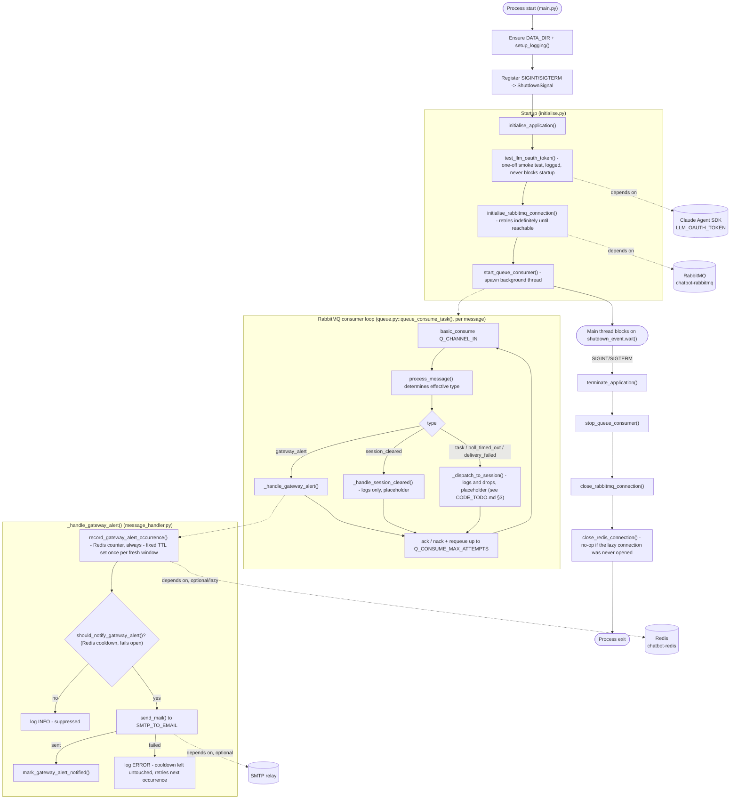

# Bot Sanctuary

Bot Sanctuary is the successor to `bot_orchestrator`'s routing role, merged with the AI agent pipeline itself - one consolidated Python application rather than a separate orchestrator container plus per-agent containers. It owns RabbitMQ consumption from `telegram_gateway`, per-session threading, the multi-agent "Call" pipeline (via the Claude Agent SDK), tool access, and error/alert routing.

All application code runs inside a Docker container - there is no standalone (non-Docker) execution path.

**Status:** RabbitMQ connectivity, SMTP send/test capability, and `gateway_alert` notification (throttled, Redis-backed) are implemented. The session-routing/agent-call pipeline itself is not yet built - see `CODE_TODO.md` for current status and design.

## Infrastructure
Python application root is located at
```
bot_sanctuary/bot_sanctuary_application
```
- Python 3.12 (`python:3.12.4-slim` base image)
- Runs as a Docker container on the project's isolated bridge network (`chatbot-app-network`)
- Depends on RabbitMQ for internal messaging (see `utilities/utils_queue/queue.py`)
- Depends on the Claude Agent SDK (`LLM_OAUTH_TOKEN`) for the agent pipeline
- Optionally depends on an SMTP relay for Tier 2 (`gateway_alert`) alerting (see `utilities/utils_smtp/smtp_handler.py`) - inert until explicitly configured
- Optionally depends on Redis, for a durable, once-per-day throttle on `gateway_alert` notification emails (see `utilities/utils_redis/database.py`) - not a hard startup dependency; connects lazily and fails open if unreachable

### Project Structure
- `main.py` - application entry point; configures logging, registers shutdown signal handlers, and drives startup/shutdown.
- `config.py` - centralised, environment-driven application configuration (see Environment Variables below).
- `utilities/initialise.py` - startup/shutdown orchestration (`initialise_application()` / `terminate_application()`).
- `utilities/logging_setup.py` - console and rotating file logging configuration.
- `utilities/utilities.py` - shared, dependency-free helpers (e.g. `ShutdownSignal`).
- `utilities/utils_queue/` - RabbitMQ connection lifecycle (single shared consume connection, per-thread `RabbitMQPublisher`) and inbound message dispatch.
- `utilities/utils_smtp/` - SMTP send/test capability for Tier 2 alerting.
- `utilities/utils_redis/` - Redis-backed `gateway_alert` notification throttle (occurrence count + last-notified timestamp only - not session/task state).
- `data/logs/` - runtime log output (rotating daily, see Logging below).

### Application Lifecycle

#### Startup
`main.py` is the entry point:
1. Ensures `DATA_DIR` exists and configures logging (`setup_logging()`).
2. Registers `SIGINT`/`SIGTERM` handlers against a shared `ShutdownSignal`.
3. Calls `initialise_application()` (`utilities/initialise.py`), which:
   - Runs a one-off `LLM_OAUTH_TOKEN` startup smoke test (`test_llm_oauth_token()`) - logged, never crashes startup on failure.
   - Opens the RabbitMQ consume connection (retrying indefinitely if not yet reachable - see "Design Decisions" below) and starts the background consumer thread.
4. The main thread then blocks on `_shutdown_event.wait()` - from this point on, the application runs entirely on background threads.

#### Runtime
**RabbitMQ consumer loop** (`utilities/utils_queue/queue.py::queue_consume_task()`) - one iteration per message:
- Consumes from `Q_CHANNEL_IN` (`telegram_gateway`'s own outbound queue) via `basic_consume`.
- Decodes the message body and passes it to `process_message()` (`utils_queue/message_handler.py`), which determines the message's effective type - the Task Queue Payload carries no explicit `type` field, treated as an implicit `task` - and dispatches:
  - `gateway_alert` (systemic, no `session_id`) → its own handler - every occurrence is logged critically and counted in Redis; a notification email is sent to `SMTP_TO_EMAIL`, throttled to at most once every `GATEWAY_ALERT_NOTIFY_COOLDOWN_SECONDS` (default 24h) so a sustained outage doesn't spam one email per event.
  - `session_cleared` → its own handler - currently logs only; session worker teardown not yet implemented.
  - Everything else (an implicit task, `poll_timed_out`, `delivery_failed`) → session routing - currently logs a warning and drops the message; the per-session worker registry described in `CODE_TODO.md` §3 is not implemented yet.
- Acks on success. On failure, nacks with requeue up to `Q_CONSUME_MAX_ATTEMPTS`, then drops. Reconnects automatically on a connection-level failure.

#### Shutdown
On `SIGINT`/`SIGTERM`, the signal handler sets the shared `ShutdownSignal`, waking the blocked main thread, which calls `terminate_application()`:
1. `stop_queue_consumer()` - signals the RabbitMQ consumer to stop.
2. `close_rabbitmq_connection()` - closes the RabbitMQ consume channel/connection.
3. `close_redis_connection()` - closes the Redis client, if the `gateway_alert` throttle's lazy connection was ever actually opened (safe no-op otherwise).

## Getting Started
The Bot Sanctuary container is intended to be managed by the project's root `./setup.sh` script (run from the `server-ai-chatbot-setup` root directory) and is not typically invoked directly.
You may use the helper script, `setup.sh`, for standalone `bot_sanctuary` development.

### First-Time Setup
**Step 1:** Run helper script
```bash
./setup.sh
```
**Step 2:** Select option 1 to build and run the project
```
1
```

### Running the Project
Once built, use the same helper script, run from the root directory of the `bot_sanctuary` project, for day-to-day container management.
```bash
./setup.sh
```

#### Useful Docker Commands
```bash
docker ps
docker images
docker rmi <docker-image-name>
docker start <docker-container-name>
docker stop <docker-container-name>
docker restart <docker-container-name>
```

#### Testing SMTP Configuration
Once `SMTP_ENABLE_MAILER=true` and the other `SMTP_*` settings are configured (see Environment Variables below), verify the configuration actually works end-to-end - without waiting for a real `gateway_alert` to happen - by triggering the test function manually:
```bash
docker exec <container_name> python -m bot_sanctuary_application.utilities.utils_smtp.smtp_handler
```
The test email is sent to `SMTP_TO_EMAIL` by default; pass a recipient explicitly to override it for one-off testing:
```bash
docker exec <container_name> python -m bot_sanctuary_application.utilities.utils_smtp.smtp_handler someone@example.com
```
Exits `0` on success, `1` on failure - check the container logs (`data/logs/bot_sanctuary.log`, or `docker logs <container_name>`) either way for details.

## Documentation

### Logging
- Logged to both the console (stdout) and a rotating file at `bot_sanctuary_application/data/logs/bot_sanctuary.log`, rotated daily at midnight (or on reaching `LOG_MAX_SIZE_MB`), retained for `LOG_RETENTION_DAYS` days.
- Format: `%(asctime)s | %(levelname)s | %(name)s | %(message)s`.
- Verbosity is controlled by `LOG_LEVEL`.

| Level | Purpose |
|---------|---------|
| DEBUG | Detailed diagnostic information. |
| INFO | Normal application events, e.g. a mail sent, the RabbitMQ consumer started, a connection retry. |
| WARNING | A recoverable issue, e.g. a session-scoped message dropped because session routing isn't implemented yet, RabbitMQ not yet reachable at startup. |
| ERROR | A single operation failed and was dropped, e.g. a malformed payload, a failed SMTP test. |
| CRITICAL | A systemic failure requiring attention, e.g. an unrecognised/invalid queue payload, a `gateway_alert` received. |

### Design Decisions
- **Startup connection retries indefinitely, never crash-exits** - `initialise_rabbitmq_connection()` blocks, retrying on a fixed delay (`Q_CONNECT_RETRY_DELAY_SECONDS`), whenever RabbitMQ is not yet reachable at container start, rather than propagating the failure and killing the process - see `CODE_TODO.md` for the reasoning (mirrors a fix already applied in `telegram_gateway`).
- **Per-thread RabbitMQ publish connections, not a shared one** - `RabbitMQPublisher` is a thin, caller-owned wrapper intended to be instantiated once per (future) session worker thread, since a pika connection/channel is not thread-safe and a lock around a shared one is documented as insufficient. Not yet instantiated anywhere - see `CODE_TODO.md` §3.
- **`TELEGRAM_BOT_NAME` reused for the SMTP `From` display name** - rather than a separate SMTP-only name setting, `utils_smtp/smtp_handler.py` reuses the same bot persona name `telegram_gateway` already uses (both sourced from the same root `config.ini` `CHATBOT_NAME`), so mail identifies as the same persona the user talks to on Telegram.
- **SMTP credentials are never logged in full** - `SMTP_FROM_EMAIL`/`SMTP_USERNAME`/`SMTP_PASSWORD` are only ever logged as `<set>`/`<unset>`, never any part of the actual value.
- **A separate Redis ACL user for this application** - `REDIS_USERNAME`/`REDIS_PASSWORD` are a distinct login from `telegram_gateway`'s own Redis credentials, scoped (via Redis ACL, `~bot_sanctuary:*`) to only this application's own keys, even though both share the same Redis container.
- **The `gateway_alert` throttle fails open on a Redis outage** - if Redis is unreachable, a notification is still allowed to send rather than being silently suppressed. Missing the throttle occasionally (an over-notification) is judged less harmful than a total alerting blackout on the one path that exists specifically to warn a human something else is broken.
- **The occurrence counter and notification cooldown both carry a fixed, guaranteed `GATEWAY_ALERT_NOTIFY_COOLDOWN_SECONDS` (default 24h) fallback expiry, via Redis TTL, not a `telegram_gateway` signal** - `bot_sanctuary:gateway_alert:count` gets its TTL applied once, the first time it's created for a fresh window; `bot_sanctuary:gateway_alert:last_notified_at` gets its TTL set on every write (i.e. every successful notification). Neither TTL is refreshed/extended by a later occurrence - deliberately: a TTL renewed on every occurrence could never expire for as long as occurrences kept arriving, which would make the fallback reset impossible during a sustained incident. Both keys therefore always self-clear exactly `GATEWAY_ALERT_NOTIFY_COOLDOWN_SECONDS` after being written, regardless of how much more data shows up in between - entirely self-contained to this application, no `telegram_gateway` signal required.

### Limitations
- The session-routing/per-session worker pipeline (the actual agent Call pipeline this application exists to run) is not implemented yet - every consumed RabbitMQ message that would route to a session is currently logged and dropped. See `CODE_TODO.md` §3.
- `gateway_alert` notification is throttled but dispatched synchronously - `send_mail()` (and the Redis throttle calls) run on the RabbitMQ consumer thread itself, so a slow/hanging SMTP or Redis call can stall message consumption while it's in flight. Not yet a concern in practice (rare, systemic events), but worth revisiting once the session-routing pipeline exists. See `CODE_TODO.md` §4.
- The `gateway_alert` throttle window is a rolling cooldown from the last notification, not a calendar-day reset - two notifications could still land close together either side of local midnight.
- Requires RabbitMQ to be reachable at startup (retries indefinitely rather than failing). Redis is not required at startup - see Design Decisions above.

### Environment Variables

#### Application / Logging
| Variable | Purpose |
|---------|---------|
| LOG_LEVEL | Root logger verbosity. |
| LOG_MAX_SIZE_MB | File size that triggers a log rotation, alongside the daily rotation. |
| LOG_RETENTION_DAYS | Number of rotated log files kept before deletion. |

#### LLM Provider
| Variable | Purpose |
|---------|---------|
| LLM_TYPE | LLM provider identity - only `"claude"` is currently supported by the startup smoke test. |
| LLM_OAUTH_TOKEN | Claude Agent SDK OAuth credential, bridged into `CLAUDE_CODE_OAUTH_TOKEN` at the one call site that needs it. |

#### Bot Identity
| Variable | Purpose |
|---------|---------|
| TELEGRAM_BOT_NAME | Persona name, shared with `telegram_gateway` (same root `config.ini` `CHATBOT_NAME` value) - used as the display name on the SMTP `From` header. |

#### Queue Connection
| Variable | Purpose |
|---------|---------|
| Q_HOST / Q_USER / Q_PASSWORD / Q_PORT / Q_VHOST | RabbitMQ connection details. |
| Q_CHANNEL_IN | Queue this application consumes from - `telegram_gateway`'s own outbound queue. |
| Q_CHANNEL_OUT | Queue this application publishes to - `telegram_gateway`'s own inbound queue. |
| Q_PUSH_MAX_ATTEMPTS / Q_PUSH_RETRY_DELAY | Bounded retry/backoff for a `RabbitMQPublisher.publish()` call. |
| Q_HEARTBEAT / Q_BLOCKED_CONNECTION_TIMEOUT | Pika connection-level timeouts. |
| Q_CONSUME_RETRY_DELAY | Delay before the consumer loop reconnects after a connection-level failure. |
| Q_CONSUME_MAX_ATTEMPTS | Retry attempts for a message that fails to process before it is dropped. |
| Q_CONNECT_RETRY_DELAY_SECONDS | Delay between startup connection attempts while RabbitMQ is not yet reachable. |

#### SMTP / Mailer
| Variable | Purpose |
|---------|---------|
| SMTP_ENABLE_MAILER | `send_mail()` is a no-op until this is `true`. |
| SMTP_FORCE_SSL | Connect via implicit TLS (`smtplib.SMTP_SSL`, typically port 465) instead of STARTTLS. |
| SMTP_AUTH_TYPE | `"NONE"` (case-insensitive) skips authentication entirely; any other value (default `"LOGIN"`) authenticates via `SMTP_USERNAME`/`SMTP_PASSWORD`. |
| SMTP_SKIP_TLS | No TLS at all (plain SMTP, typically port 25) - only appropriate for a trusted internal relay. Ignored if `SMTP_FORCE_SSL` is also set. |
| SMTP_HOST / SMTP_PORT | SMTP server connection details. |
| SMTP_FROM_EMAIL | Envelope and header sender address. |
| SMTP_TO_EMAIL | Recipient for a `gateway_alert` notification email; also the default for `test_smtp_configuration()` when no recipient is passed explicitly. |
| SMTP_USERNAME / SMTP_PASSWORD | SMTP credentials, used unless `SMTP_AUTH_TYPE="NONE"`. |

#### gateway_alert Throttle
| Variable | Purpose |
|---------|---------|
| GATEWAY_ALERT_NOTIFY_COOLDOWN_SECONDS | Minimum time between `gateway_alert` notification emails (default 86400 = 24h) - every occurrence is still counted regardless. Also the fixed, non-renewed Redis TTL fallback on both the occurrence counter and the notification cooldown - see Design Decisions above. |

#### Redis Connection (gateway_alert throttle only)
| Variable | Purpose |
|---------|---------|
| REDIS_HOST / REDIS_PORT | Redis connection details - same `chatbot-redis` container `telegram_gateway` uses. |
| REDIS_USERNAME / REDIS_PASSWORD | A separate ACL login from `telegram_gateway`'s own Redis credentials, scoped to only this application's `bot_sanctuary:*` keys. |
| REDIS_DB | Logical database index - defaults to `1` (vs `telegram_gateway`'s `0`) as a second layer of separation on top of the ACL restriction. |
| REDIS_SOCKET_CONNECT_TIMEOUT / REDIS_SOCKET_TIMEOUT | Bounds a Redis network-level stall so a check fails fast rather than blocking indefinitely. |
| REDIS_SOCKET_KEEPALIVE | Whether the Redis client keeps its TCP connection alive between operations. |
| REDIS_HEALTH_CHECK_INTERVAL | How often the Redis client proactively pings the connection to detect a stale/dead socket. |

## Project Architecture

The diagram below traces the application's process lifecycle - startup, the RabbitMQ consumer loop (including the `gateway_alert` notification path), and shutdown - at a whiteboard level. The session-routing/agent-call pipeline itself is not yet implemented (see `CODE_TODO.md`), so it is shown only as the placeholder drop path it currently is.


