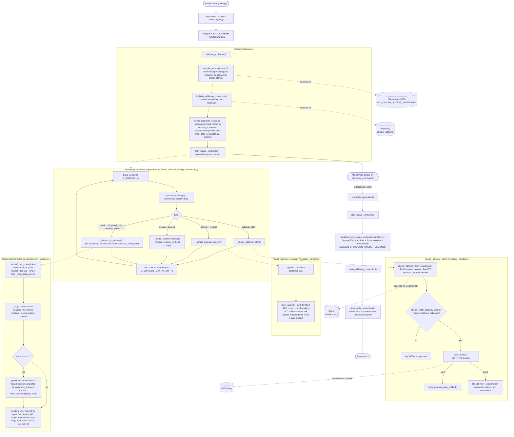

# Bot Sanctuary

Bot Sanctuary is the successor to `bot_orchestrator`'s routing role, merged with the AI agent pipeline itself - one consolidated Python application rather than a separate orchestrator container plus per-agent containers. It owns RabbitMQ consumption from `telegram_gateway`, per-session threading, the multi-agent "Call" pipeline (via the Claude Agent SDK), tool access, and error/alert routing.

All application code runs inside a Docker container - there is no standalone (non-Docker) execution path.

**Status:** RabbitMQ connectivity, SMTP send/test capability, `gateway_alert`/`gateway_recover` notification (throttled, Redis-backed), and per-session message routing/coalescing are implemented. The agent Call pipeline itself (the part that actually talks to the LLM and replies) is not yet built - see `CODE_TODO.md` for current status and design.

## Infrastructure
Python application root is located at
```
bot_sanctuary/bot_sanctuary_application
```
- Python 3.12 (`python:3.12.4-slim` base image)
- Runs as a Docker container on the project's isolated bridge network (`chatbot-app-network`)
- Depends on RabbitMQ for internal messaging (see `utilities/utils_queue/queue.py`)
- Depends on the Claude Agent SDK for the agent pipeline
- All four LLM providers are wired (see `utilities/utils_agents/`), each with its own per-provider credential (`LLM_CLAUDE_*`/`LLM_CODEX_*`/`LLM_DEEPSEEK_*`/`LLM_QWEN_*` - see Environment Variables below) - more than one can be configured at once: `claude` via the Claude Agent SDK, `codex` via shelling out to its own CLI's `codex exec` non-interactive mode (no OpenAI/Codex Python SDK dependency exists), and `deepseek`/`qwen` via a direct REST call to their own OpenAI-compatible chat completions endpoint (stdlib `urllib`, no SDK dependency either). `claude`/`codex` CLIs are both also installed natively in the image (see "LLM Provider CLI Login" below) for their OAuth login flows. `deepseek`/`qwen` are API-key-only - neither has an OAuth mechanism today (DeepSeek never has; Qwen's free OAuth tier was discontinued 2026-04-15) - so no CLI/login step applies to either.
- Optionally depends on an SMTP relay for Tier 2 (`gateway_alert`) alerting (see `utilities/utils_smtp/smtp_handler.py`) - inert until explicitly configured
- Optionally depends on Redis, for a durable, once-per-day throttle on `gateway_alert` notification emails (see `utilities/utils_redis/database.py`) - not a hard startup dependency; connects lazily and fails open if unreachable

### Project Structure
- `main.py` - application entry point; configures logging, registers shutdown signal handlers, and drives startup/shutdown.
- `config.py` - centralised, environment-driven application configuration (see Environment Variables below).
- `utilities/initialise.py` - startup/shutdown orchestration (`initialise_application()` / `terminate_application()`).
- `utilities/logging_setup.py` - console and rotating file logging configuration.
- `utilities/utilities.py` - shared, dependency-free helpers (e.g. `ShutdownSignal`).
- `utilities/utils_agents/` - `agent_interface.py::query_llm(llm_type, prompt)` dispatches to an explicitly-named provider (no single global "current" provider), plus one `<provider>_interface.py` per provider: `claude_interface.py` (Claude Agent SDK), `codex_interface.py` (shells out to the `codex` CLI), `deepseek_interface.py`/`qwen_interface.py` (direct REST call to each provider's own OpenAI-compatible endpoint, stdlib `urllib`, no SDK dependency). Each exposes `query_via_oauth(prompt, token)`/`query_via_api(prompt, token)` - a pure function of its arguments, not global config state - `deepseek`/`qwen`'s own `query_via_oauth()` is a "not supported" stub, since neither provider has an OAuth mechanism (see their own module Notes).
- `utilities/utils_queue/` - RabbitMQ connection lifecycle (single shared consume connection, per-thread `RabbitMQPublisher`) and inbound message dispatch.
- `utilities/utils_smtp/` - SMTP send/test capability for Tier 2 alerting.
- `utilities/utils_redis/` - Redis-backed `gateway_alert` notification throttle (occurrence count + last-notified timestamp), plus a durable, crash-recovery active-task record (see `utilities/utils_session/`).
- `utilities/utils_session/` - the per-session worker registry (`SessionWorker`) - see Runtime below and `CODE_TODO.md` §3.
- `data/logs/` - runtime log output (rotating daily, see Logging below).

### Application Lifecycle

#### Startup
`main.py` is the entry point:
1. Ensures `DATA_DIR` exists and configures logging (`setup_logging()`).
2. Registers `SIGINT`/`SIGTERM` handlers against a shared `ShutdownSignal`.
3. Calls `initialise_application()` (`utilities/initialise.py`), which:
   - Runs a one-off startup smoke test (`test_llm_tokens()`) for every LLM provider that has a credential configured - logged, never crashes startup on failure.
   - Opens the RabbitMQ consume connection (retrying indefinitely if not yet reachable - see "Design Decisions" below).
   - Runs the crash-recovery sweep (`resync_orphaned_sessions()`) - see "Crash recovery" below - **before** starting the consumer thread, so no new task can race it.
   - Starts the background consumer thread.
4. The main thread then blocks on `_shutdown_event.wait()` - from this point on, the application runs entirely on background threads.

#### Runtime
**RabbitMQ consumer loop** (`utilities/utils_queue/queue.py::queue_consume_task()`) - one iteration per message:
- Consumes from `Q_CHANNEL_IN` (`telegram_gateway`'s own outbound queue) via `basic_consume`.
- Decodes the message body and passes it to `process_message()` (`utils_queue/message_handler.py`), which determines the message's effective type - the Task Queue Payload carries no explicit `type` field, treated as an implicit `task` - and dispatches:
  - `gateway_alert` (systemic, no `session_id`) → its own handler - every occurrence is logged critically and counted in Redis; a notification email is sent to `SMTP_TO_EMAIL`, throttled to at most once every `GATEWAY_ALERT_NOTIFY_COOLDOWN_SECONDS` (default 24h) so a sustained outage doesn't spam one email per event.
  - `gateway_recover` (systemic, no `session_id`) → its own handler - `telegram_gateway` only ever sends this once a prior `gateway_alert` has actually fired, so it's logged at INFO and immediately clears the `gateway_alert` throttle (both the occurrence count and the notification cooldown), so the next, unrelated incident starts fresh rather than waiting out the rest of the 24h fallback window.
  - `session_cleared` → stops and removes the corresponding `SessionWorker` (if one exists) from the session registry.
  - Everything else (an implicit task, `poll_timed_out`, `delivery_failed`) → `get_or_create_session_worker(session_id).submit(data)` - creates a `SessionWorker` on first use for a `session_id`, otherwise hands off to the existing one. `submit()` never blocks the consumer thread (a bounded, non-blocking queue, dropped-and-logged-critically on overflow).
- Acks on success. On failure, nacks with requeue up to `Q_CONSUME_MAX_ATTEMPTS`, then drops. Reconnects automatically on a connection-level failure.
- **Ack happens immediately after a session-routed message is successfully registered into its `SessionWorker`'s inbox, not once actually processed** - if registration itself fails (a full inbox), the message is *not* acked; an exception propagates up through this same nack-with-requeue path instead. At-least-once delivery still weakens for whatever's sitting queued-but-unprocessed at the moment of a crash (an already-acked, already-registered message); see "Crash recovery" below for how that gap is detected and recovered from after the fact, rather than prevented outright.

**Per-session worker** (`utilities/utils_session/session_worker.py::SessionWorker`) - one instance per `session_id`, created lazily on first use and kept alive across every subsequent task under that `session_id` (not one thread per message):
- Its own inbox (bounded `queue.Queue`, `SESSION_INBOX_MAX_SIZE`) and its own dedicated, long-lived `RabbitMQPublisher` connection (confined to this worker's own thread for its whole life, never shared).
- **Coalesces whatever's already queued into one combined turn**, rather than firing one turn per message: blocks for the first message, then non-blockingly drains anything else already waiting, joins their `text` fields, and (once the agent Call pipeline exists) sends the combined result through as a single turn. This assumes consecutive messages arriving before a turn starts represent one continued thought, not independent requests - mirrors `telegram_gateway`'s own existing caption+text concatenation for a finalised draft.
- **Every `task_id` in a coalesced batch except the last is closed out immediately** - `{"task_id": ..., "type": "completed"}` (`telegram_gateway`'s own existing terminal marker - cleanup only, no reply sent), published on a separate, disposable connection concurrently with whatever the turn itself does next - so they don't stay "open" on `telegram_gateway`'s side for the whole turn duration. Only the batch's last `task_id` carries the eventual real reply.
- The agent Call pipeline itself is not yet implemented - today, a `SessionWorker` logs what it would send and to which `task_id` it would reply, nothing more.

**Crash recovery** (`utilities/utils_redis/database.py`, `utilities/utils_session/session_worker.py::resync_orphaned_sessions()`) - every accepted `task_id` is durably recorded (`mark_task_active()`) the moment it's queued; cleared (`mark_task_complete()`) once actually resolved. At startup, before the consumer thread starts, `resync_orphaned_sessions()` sweeps whatever's still recorded, groups it by `session_id`, and requests a `session_reset` from `telegram_gateway` per distinct session (its existing "orchestrator requests a reset" contract - no `telegram_gateway` changes needed). **Known interim limitation:** until the agent Call pipeline above reliably marks every task complete on every exit path, every task ever accepted still looks "active" after any restart - including an ordinary clean redeploy, not just a genuine crash - so this currently requests a reset for every chat with unresolved history on every startup. See `CODE_TODO.md` §3.

#### Shutdown
On `SIGINT`/`SIGTERM`, the signal handler sets the shared `ShutdownSignal`, waking the blocked main thread, which calls `terminate_application()`:
1. `stop_queue_consumer()` - signals the RabbitMQ consumer to stop, so no new task can reach a `SessionWorker` that's about to be asked to shut down.
2. `shutdown_all_session_workers()` - signals every active `SessionWorker` to finish whatever's currently queued (draining it fully, not just whatever batch is already in flight) rather than abandoning it, then blocks on each worker's thread finishing (bounded by `SESSION_SHUTDOWN_TIMEOUT_SECONDS`, default 30s; `0` waits indefinitely). Distinct from the immediate `stop()` used by `session_cleared` - see "Design Decisions" below.
3. `close_rabbitmq_connection()` - closes the RabbitMQ consume channel/connection.
4. `close_redis_connection()` - closes the Redis client, if the `gateway_alert` throttle's lazy connection was ever actually opened (safe no-op otherwise).

## Getting Started
The Bot Sanctuary container is intended to be managed by the project's root `./setup.sh` script (run from the `server-ai-chatbot-setup` root directory) and is not typically invoked directly.
You may use the helper script, `setup.sh`, for standalone `bot_sanctuary` development.

### First-Time Setup
**Step 1:** Run helper script
```bash
./setup.sh
```
**Step 2:** Select option 1 to build and run the project
```
1
```

### Running the Project
Once built, use the same helper script, run from the root directory of the `bot_sanctuary` project, for day-to-day container management.
```bash
./setup.sh
```

#### Useful Docker Commands
```bash
docker ps
docker images
docker rmi <docker-image-name>
docker start <docker-container-name>
docker stop <docker-container-name>
docker restart <docker-container-name>
```

#### LLM Provider CLI Login
The `claude` and `codex` CLIs are both installed natively into the image (see Dockerfile). Each persists its own login/session state to its own subfolder of a single bind-mounted host directory, `bot_directory` (`bot_directory/claude` → `~/.claude`, `bot_directory/codex` → `~/.codex` - see `compose.dev.yml`/`setup.sh`), so a login survives a container recreation. `bot_directory/qwen`/`bot_directory/deepseek` are provisioned the same way (one subfolder per provider) but have no CLI login step of their own - `qwen`/`deepseek` are API-key-only (see Infrastructure above), no CLI is installed for either, and neither subfolder is actually read from at runtime; `deepseek`'s in particular is kept purely as a placeholder, since DeepSeek has no official CLI at all. Each provider now has its own independent access type/credential pair (`LLM_<PROVIDER>_ACCESS_TYPE`/`LLM_<PROVIDER>_TOKEN` - see Environment Variables below) - more than one provider can be configured (and startup-tested) at once. With a given provider's own `ACCESS_TYPE="OAUTH"` (`claude`/`codex` only), its persisted login session is what's actually used at runtime; with `ACCESS_TYPE="API"` (the only supported value for `deepseek`/`qwen`), that provider's own `TOKEN` (an API key) is used instead and no login is required.

**Claude** - generates the long-lived token the application uses when `LLM_CLAUDE_ACCESS_TYPE="OAUTH"` (see Environment Variables below):
```bash
docker exec -it <container_name> claude setup-token
```
Complete the printed browser step, then copy the resulting token into `config.ini`'s `CHATBOT_LLM_CLAUDE_TOKEN` (with `CHATBOT_LLM_CLAUDE_ACCESS_TYPE="OAUTH"`) and restart the container. `setup-token` is used deliberately over `claude login` - its token is long-lived (about a year) and avoids a documented refresh bug affecting `--print`/headless login flows.

**Codex** (OpenAI) - installed alongside `claude`, same OAuth login pattern:
```bash
docker exec -it <container_name> codex login
```
Complete the printed browser step. Credentials land in `~/.codex/auth.json`, inside the persisted `bot_directory/codex` mount. With `LLM_CODEX_ACCESS_TYPE="OAUTH"`, `codex_interface.py` shells out to `codex exec` with no `OPENAI_API_KEY` set, so this logged-in session is what's actually used - no `LLM_CODEX_TOKEN` needed in that case. With `LLM_CODEX_ACCESS_TYPE="API"` instead, `LLM_CODEX_TOKEN` (an OpenAI API key) is bridged into `OPENAI_API_KEY` for that call instead, and this login step isn't needed.

**DeepSeek** / **Qwen** - no CLI, no login step. Set `LLM_DEEPSEEK_ACCESS_TYPE`/`LLM_QWEN_ACCESS_TYPE` to `"API"` (the only value either supports - the default already), and `LLM_DEEPSEEK_TOKEN`/`LLM_QWEN_TOKEN` to that provider's own API key (a DeepSeek platform key, or a DashScope/OpenAI-compatible key for Qwen). `deepseek_interface.py`/`qwen_interface.py` call each provider's own OpenAI-compatible REST endpoint directly with that key - no OAuth path exists for either.

#### Testing SMTP Configuration
Once `SMTP_ENABLE_MAILER=true` and the other `SMTP_*` settings are configured (see Environment Variables below), verify the configuration actually works end-to-end - without waiting for a real `gateway_alert` to happen - by triggering the test function manually:
```bash
docker exec <container_name> python -m bot_sanctuary_application.utilities.utils_smtp.smtp_handler
```
The test email is sent to `SMTP_TO_EMAIL` by default; pass a recipient explicitly to override it for one-off testing:
```bash
docker exec <container_name> python -m bot_sanctuary_application.utilities.utils_smtp.smtp_handler someone@example.com
```
Exits `0` on success, `1` on failure - check the container logs (`data/logs/bot_sanctuary.log`, or `docker logs <container_name>`) either way for details.

## Documentation

### Logging
- Logged to both the console (stdout) and a rotating file at `bot_sanctuary_application/data/logs/bot_sanctuary.log`, rotated daily at midnight (or on reaching `LOG_MAX_SIZE_MB`), retained for `LOG_RETENTION_DAYS` days.
- Format: `%(asctime)s | %(levelname)s | %(name)s | %(message)s`.
- Verbosity is controlled by `LOG_LEVEL`.

| Level | Purpose |
|---------|---------|
| DEBUG | Detailed diagnostic information. |
| INFO | Normal application events, e.g. a mail sent, the RabbitMQ consumer started, a connection retry. |
| WARNING | A recoverable issue, e.g. a session-scoped message dropped because session routing isn't implemented yet, RabbitMQ not yet reachable at startup. |
| ERROR | A single operation failed and was dropped, e.g. a malformed payload, a failed SMTP test. |
| CRITICAL | A systemic failure requiring attention, e.g. an unrecognised/invalid queue payload, a `gateway_alert` received. |

### Design Decisions
- **Startup connection retries indefinitely, never crash-exits** - `initialise_rabbitmq_connection()` blocks, retrying on a fixed delay (`Q_CONNECT_RETRY_DELAY_SECONDS`), whenever RabbitMQ is not yet reachable at container start, rather than propagating the failure and killing the process - see `CODE_TODO.md` for the reasoning (mirrors a fix already applied in `telegram_gateway`).
- **Per-thread RabbitMQ publish connections, not a shared one** - `RabbitMQPublisher` is a thin, caller-owned wrapper intended to be instantiated once per (future) session worker thread, since a pika connection/channel is not thread-safe and a lock around a shared one is documented as insufficient. Not yet instantiated anywhere - see `CODE_TODO.md` §3.
- **`TELEGRAM_BOT_NAME` reused for the SMTP `From` display name** - rather than a separate SMTP-only name setting, `utils_smtp/smtp_handler.py` reuses the same bot persona name `telegram_gateway` already uses (both sourced from the same root `config.ini` `CHATBOT_NAME`), so mail identifies as the same persona the user talks to on Telegram.
- **SMTP credentials are never logged in full** - `SMTP_FROM_EMAIL`/`SMTP_USERNAME`/`SMTP_PASSWORD` are only ever logged as `<set>`/`<unset>`, never any part of the actual value.
- **A separate Redis ACL user for this application** - `REDIS_USERNAME`/`REDIS_PASSWORD` are a distinct login from `telegram_gateway`'s own Redis credentials, scoped (via Redis ACL, `~bot_sanctuary:*`) to only this application's own keys, even though both share the same Redis container.
- **The `gateway_alert` throttle fails open on a Redis outage** - if Redis is unreachable, a notification is still allowed to send rather than being silently suppressed. Missing the throttle occasionally (an over-notification) is judged less harmful than a total alerting blackout on the one path that exists specifically to warn a human something else is broken.
- **The occurrence counter and notification cooldown both carry a fixed, guaranteed `GATEWAY_ALERT_NOTIFY_COOLDOWN_SECONDS` (default 24h) fallback expiry, via Redis TTL** - `bot_sanctuary:gateway_alert:count` gets its TTL applied once, the first time it's created for a fresh window; `bot_sanctuary:gateway_alert:last_notified_at` gets its TTL set on every write (i.e. every successful notification). Neither TTL is refreshed/extended by a later occurrence - deliberately: a TTL renewed on every occurrence could never expire for as long as occurrences kept arriving, which would make the fallback reset impossible during a sustained incident. Both keys therefore always self-clear exactly `GATEWAY_ALERT_NOTIFY_COOLDOWN_SECONDS` after being written, regardless of how much more data shows up in between - this fallback is entirely self-contained to this application and does not depend on any signal from `telegram_gateway` arriving.
- **Both keys are also reset early on a `gateway_recover` event** - `telegram_gateway` only ever emits `gateway_recover` once a prior `gateway_alert` has actually fired for that incident, so receiving it is an unambiguous "the incident is over" signal: the occurrence count and cooldown are cleared immediately (`reset_gateway_alert_throttle()`) rather than waiting out the rest of the 24h window, so a future, unrelated incident starts fresh. This does not replace the TTL fallback above - it's an earlier, precise reset for the common case where `gateway_recover` is actually received; the TTL remains the backstop for the case that message is ever lost.
- **`SessionWorker` has two independent, deliberately different stop paths** - `stop()` (immediate, abandons whatever's still queued - used by `session_cleared`, where `telegram_gateway` has already wiped that session on its own side) and `shutdown()` (drains and fully processes whatever's queued first - used by `shutdown_all_session_workers()` at application shutdown, since every queued item was already acked off RabbitMQ and abandoning it there would be a real message loss, not a stale one). See `CODE_TODO.md` §3.

### Limitations
- The agent Call pipeline itself (the part that actually talks to the LLM and replies) is not implemented yet - a `SessionWorker` fully receives, coalesces, and logs every session-routed message, but never invokes an LLM or publishes a real reply. See `CODE_TODO.md` §3/§5.
- `gateway_alert` notification is throttled but dispatched synchronously - `send_mail()` (and the Redis throttle calls) run on the RabbitMQ consumer thread itself, so a slow/hanging SMTP or Redis call can stall message consumption while it's in flight. Not yet a concern in practice (rare, systemic events), but worth revisiting once the agent Call pipeline exists. See `CODE_TODO.md` §4.
- The crash-recovery startup sweep (`resync_orphaned_sessions()`) currently over-triggers: since the agent Call pipeline doesn't yet reliably mark every task complete, it requests a `session_reset` for every chat with unresolved history on *every* restart, not just a genuine crash. Accepted for now, per explicit instruction - see `CODE_TODO.md` §3.
- The `gateway_alert` throttle window is a rolling cooldown from the last notification, not a calendar-day reset - two notifications could still land close together either side of local midnight.
- Requires RabbitMQ to be reachable at startup (retries indefinitely rather than failing). Redis is not required at startup - see Design Decisions above.
- `codex_interface.py` shells out to the `codex` CLI (`codex exec`) rather than using a Python SDK - there is no OpenAI/Codex Python SDK dependency installed.
- `config.py`'s `LLM_CHAT_TYPE` is forward-declared groundwork only - nothing calls it yet, since the pipeline it's meant to feed (the multi-agent "Call" model, `CODE_TODO.md` §5) isn't built. Per-Call provider routing (each named Call using its own provider) was proposed and is explicitly on hold until that pipeline exists - see `CODE_TODO.md` §2.
- `qwen_interface.py`'s DashScope endpoint/model (`_API_URL`/`_MODEL`) are unconfirmed assumptions, not verified against a real account - DashScope publishes region-specific base URLs and this defaults to the international one; the model name is a reasonable-guess default. See `CODE_TODO.md` §2 before relying on this in a real deployment.

### Environment Variables

#### Application / Logging
| Variable | Purpose |
|---------|---------|
| LOG_LEVEL | Root logger verbosity. |
| LOG_MAX_SIZE_MB | File size that triggers a log rotation, alongside the daily rotation. |
| LOG_RETENTION_DAYS | Number of rotated log files kept before deletion. |

#### LLM Provider
More than one provider's credentials can be configured (and startup-tested) at once - there is no single "current" provider. `utilities/utils_agents/agent_interface.py::query_llm(llm_type, prompt)` takes `llm_type` as an explicit argument per call, rather than reading one global setting.

| Variable | Purpose |
|---------|---------|
| LLM_CHAT_TYPE | Which provider the (not yet implemented) chat pipeline itself would use - `"claude"`, `"codex"`, `"deepseek"`, or `"qwen"`. **Forward-declared groundwork only - nothing reads this yet**, since the pipeline it's meant to feed (`CODE_TODO.md` §5) isn't built. Per-Call provider routing (each named Call using its own provider) is on hold until then - see `CODE_TODO.md` §2. |
| LLM_CLAUDE_ACCESS_TYPE / LLM_CLAUDE_TOKEN | Claude's own access type (`"OAUTH"` or `"API"`) and credential. Bridged into `CLAUDE_CODE_OAUTH_TOKEN`/`ANTHROPIC_API_KEY` respectively (`claude_interface.py`). |
| LLM_CODEX_ACCESS_TYPE / LLM_CODEX_TOKEN | Codex's own access type (`"OAUTH"` or `"API"`) and credential. `"API"` bridges the token into `OPENAI_API_KEY` for that `codex exec` call only (`codex_interface.py`); `"OAUTH"` ignores the token entirely and relies on the CLI's own persisted login session. |
| LLM_DEEPSEEK_ACCESS_TYPE / LLM_DEEPSEEK_TOKEN | DeepSeek's own access type (defaults to `"API"`, the only value it supports) and API key, sent as a plain `Authorization: Bearer` header (`deepseek_interface.py`). |
| LLM_QWEN_ACCESS_TYPE / LLM_QWEN_TOKEN | Qwen's own access type (defaults to `"API"`, the only value it supports today) and API key, sent as a plain `Authorization: Bearer` header (`qwen_interface.py`). |

`"OAUTH"` only actually works for `claude`/`codex` - setting `LLM_DEEPSEEK_ACCESS_TYPE`/`LLM_QWEN_ACCESS_TYPE` to `"OAUTH"` reaches that module's own `query_via_oauth()` stub, which logs a warning and returns `None` rather than doing anything, since neither provider has an OAuth mechanism today.

#### Bot Identity
| Variable | Purpose |
|---------|---------|
| TELEGRAM_BOT_NAME | Persona name, shared with `telegram_gateway` (same root `config.ini` `CHATBOT_NAME` value) - used as the display name on the SMTP `From` header. |

#### Queue Connection
| Variable | Purpose |
|---------|---------|
| Q_HOST / Q_USER / Q_PASSWORD / Q_PORT / Q_VHOST | RabbitMQ connection details. |
| Q_CHANNEL_IN | Queue this application consumes from - `telegram_gateway`'s own outbound queue. |
| Q_CHANNEL_OUT | Queue this application publishes to - `telegram_gateway`'s own inbound queue. |
| Q_PUSH_MAX_ATTEMPTS / Q_PUSH_RETRY_DELAY | Bounded retry/backoff for a `RabbitMQPublisher.publish()` call. |
| Q_HEARTBEAT / Q_BLOCKED_CONNECTION_TIMEOUT | Pika connection-level timeouts. |
| Q_CONSUME_RETRY_DELAY | Delay before the consumer loop reconnects after a connection-level failure. |
| Q_CONSUME_MAX_ATTEMPTS | Retry attempts for a message that fails to process before it is dropped. |
| Q_CONNECT_RETRY_DELAY_SECONDS | Delay between startup connection attempts while RabbitMQ is not yet reachable. |

#### SMTP / Mailer
| Variable | Purpose |
|---------|---------|
| SMTP_ENABLE_MAILER | `send_mail()` is a no-op until this is `true`. |
| SMTP_FORCE_SSL | Connect via implicit TLS (`smtplib.SMTP_SSL`, typically port 465) instead of STARTTLS. |
| SMTP_AUTH_TYPE | `"NONE"` (case-insensitive) skips authentication entirely; any other value (default `"LOGIN"`) authenticates via `SMTP_USERNAME`/`SMTP_PASSWORD`. |
| SMTP_SKIP_TLS | No TLS at all (plain SMTP, typically port 25) - only appropriate for a trusted internal relay. Ignored if `SMTP_FORCE_SSL` is also set. |
| SMTP_HOST / SMTP_PORT | SMTP server connection details. |
| SMTP_FROM_EMAIL | Envelope and header sender address. |
| SMTP_TO_EMAIL | Recipient for a `gateway_alert` notification email; also the default for `test_smtp_configuration()` when no recipient is passed explicitly. |
| SMTP_USERNAME / SMTP_PASSWORD | SMTP credentials, used unless `SMTP_AUTH_TYPE="NONE"`. |

#### gateway_alert Throttle
| Variable | Purpose |
|---------|---------|
| GATEWAY_ALERT_NOTIFY_COOLDOWN_SECONDS | Minimum time between `gateway_alert` notification emails (default 86400 = 24h) - every occurrence is still counted regardless. Also the fixed, non-renewed Redis TTL fallback on both the occurrence counter and the notification cooldown - see Design Decisions above. |

#### Session Routing
| Variable | Purpose |
|---------|---------|
| SESSION_INBOX_MAX_SIZE | Bounds each `SessionWorker`'s own inbox (default `100`). A full inbox drops the newest arrival and logs it critically rather than blocking the shared RabbitMQ consumer thread behind one stuck session. |
| SESSION_SHUTDOWN_TIMEOUT_SECONDS | Maximum seconds `terminate_application()` waits for each `SessionWorker` to finish its last queued batch on shutdown (default `30`). `0` waits indefinitely. A worker still alive once this elapses is logged and abandoned - the process exits regardless. |

#### Redis Connection (gateway_alert throttle + crash-recovery task tracking)
| Variable | Purpose |
|---------|---------|
| REDIS_HOST / REDIS_PORT | Redis connection details - same `chatbot-redis` container `telegram_gateway` uses. |
| REDIS_USERNAME / REDIS_PASSWORD | A separate ACL login from `telegram_gateway`'s own Redis credentials, scoped to only this application's `bot_sanctuary:*` keys. |
| REDIS_DB | Logical database index - defaults to `1` (vs `telegram_gateway`'s `0`) as a second layer of separation on top of the ACL restriction. |
| REDIS_SOCKET_CONNECT_TIMEOUT / REDIS_SOCKET_TIMEOUT | Bounds a Redis network-level stall so a check fails fast rather than blocking indefinitely. |
| REDIS_SOCKET_KEEPALIVE | Whether the Redis client keeps its TCP connection alive between operations. |
| REDIS_HEALTH_CHECK_INTERVAL | How often the Redis client proactively pings the connection to detect a stale/dead socket. |
| REDIS_TASK_MAX_ATTEMPTS / REDIS_TASK_RETRY_DELAY | Bounded retry (count / delay in seconds) applied to each individual Redis call (`INCR`/`GET`/`SET`/`DEL`) in `utils_redis/database.py` before falling back to that function's existing fail-open/non-fatal behaviour - same convention as `telegram_gateway`'s own `REDIS_TASK_MAX_ATTEMPTS`/`REDIS_TASK_RETRY_DELAY`. |

## Project Architecture

The diagram below traces the application's process lifecycle - startup, the RabbitMQ consumer loop (including the `gateway_alert`/`gateway_recover` notification path and the `SessionWorker` routing/coalescing path), and shutdown - at a whiteboard level. The agent Call pipeline itself is not yet implemented (see `CODE_TODO.md`), so `SWFlow` below ends at the point a real turn would be handed off, not beyond it.


