# Telegram Gateway — Code Sequence Diagrams

Sequence diagrams for every use case scenario identified in the Telegram Gateway application. Grouped and numbered to mirror the consolidated use case list.

## Table of Contents

1. [Application Lifecycle](#1-application-lifecycle)
2. [Inbound Message Reception (Long Polling)](#2-inbound-message-reception-long-polling)
3. [Plain Text Message Handling](#3-plain-text-message-handling)
4. [Media & Draft Handling](#4-media--draft-handling)
5. [Callback Query (Inline Button) Handling](#5-callback-query-inline-button-handling)
6. [Outbound Message Dispatch (from RabbitMQ)](#6-outbound-message-dispatch-from-rabbitmq)
7. [Poll Answer Collection](#7-poll-answer-collection)
8. [Session Reset Flow](#8-session-reset-flow)
9. [Typing Indicator](#9-typing-indicator)
10. [Error Handling / Delivery Failure Tiers](#10-error-handling--delivery-failure-tiers)
11. [Connection & Infrastructure Resilience](#11-connection--infrastructure-resilience)
12. [Security / Data Hygiene](#12-security--data-hygiene)

---

## 1. Application Lifecycle

### 1.1 – 1.3 Cold start (incl. crash recovery sweeps)

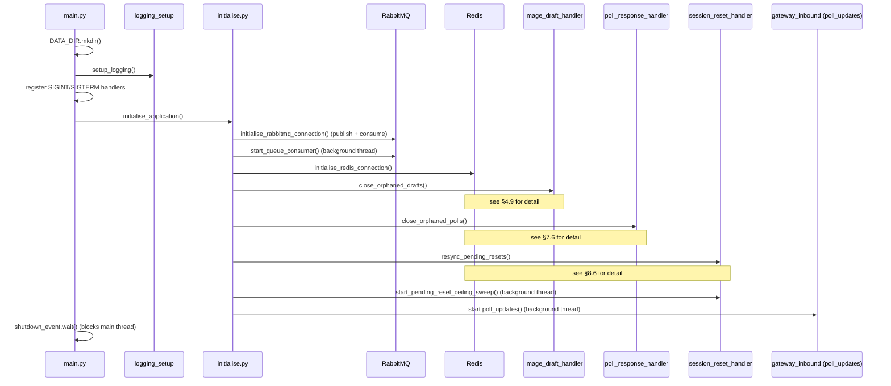
```mermaid
sequenceDiagram
    participant Main as main.py
    participant Log as logging_setup
    participant Init as initialise.py
    participant MQ as RabbitMQ
    participant Redis as Redis
    participant Draft as image_draft_handler
    participant Poll as poll_response_handler
    participant Session as session_reset_handler
    participant Gateway as gateway_inbound (poll_updates)

    Main->>Main: DATA_DIR.mkdir()
    Main->>Log: setup_logging()
    Main->>Main: register SIGINT/SIGTERM handlers
    Main->>Init: initialise_application()
    Init->>MQ: initialise_rabbitmq_connection() (publish + consume)
    Init->>MQ: start_queue_consumer() (background thread)
    Init->>Redis: initialise_redis_connection()
    Init->>Draft: close_orphaned_drafts()
    Note over Draft,Redis: see §4.9 for detail
    Init->>Poll: close_orphaned_polls()
    Note over Poll,Redis: see §7.6 for detail
    Init->>Session: resync_pending_resets()
    Note over Session,Redis: see §8.6 for detail
    Init->>Session: start_pending_reset_ceiling_sweep() (background thread)
    Init->>Gateway: start poll_updates() (background thread)
    Main->>Main: shutdown_event.wait() (blocks main thread)
```

### 1.2 Graceful shutdown (SIGINT/SIGTERM)

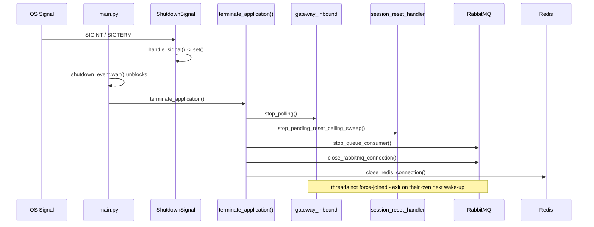
```mermaid
sequenceDiagram
    participant OS as OS Signal
    participant Main as main.py
    participant ShutdownEvt as ShutdownSignal
    participant Term as terminate_application()
    participant Gateway as gateway_inbound
    participant Session as session_reset_handler
    participant MQ as RabbitMQ
    participant Redis as Redis

    OS->>ShutdownEvt: SIGINT / SIGTERM
    ShutdownEvt->>ShutdownEvt: handle_signal() -> set()
    Main->>Main: shutdown_event.wait() unblocks
    Main->>Term: terminate_application()
    Term->>Gateway: stop_polling()
    Term->>Session: stop_pending_reset_ceiling_sweep()
    Term->>MQ: stop_queue_consumer()
    Term->>MQ: close_rabbitmq_connection()
    Term->>Redis: close_redis_connection()
    Note over Gateway,MQ: threads not force-joined - exit on their own next wake-up
```

---

## 2. Inbound Message Reception (Long Polling)

Covers: normal poll cycle, network/timeout failure, per-update retry/give-up, missing chat/user id, unauthorised access (first + repeat), unrecognised update type.

```mermaid
sequenceDiagram
    participant TG as Telegram Bot API
    participant Gateway as poll_updates()
    participant Gatekeeper as gatekeeper.py
    participant Handler as _handle_update()

    loop long-poll cycle (until stop_polling())
        Gateway->>TG: GET /getUpdates (offset, timeout, allowed_updates)
        alt network/timeout error
            TG-->>Gateway: RequestException
            Gateway->>Gateway: log_sanitised_exception(); sleep(5)
        else success
            TG-->>Gateway: 200 OK, [updates]
            loop for each update in result
                alt update missing chat_id or user_id
                    Gateway->>Gateway: log & skip (offset still advances)
                else chat_id not in TELEGRAM_ALLOWED_CHAT_IDS
                    Gateway->>Gatekeeper: track_unauthorised_access(chat_id)
                    alt first access from this chat_id
                        Gatekeeper-->>Gateway: chat_id
                        Gateway->>TG: sendMessage ("family only" + chat_id, HTML)
                    else repeat access
                        Gatekeeper-->>Gateway: None
                        Gateway->>Gateway: debug log only, no reply
                    end
                else authorised update (message / callback_query / poll_answer)
                    Gateway->>Gateway: _summarise_update() for safe logging
                    Gateway->>Handler: _handle_update(chat_id, user_id, update)
                    alt handler raises exception
                        Handler-->>Gateway: Exception
                        Gateway->>Gateway: _update_attempts[update_id] += 1
                        alt attempts < TELEGRAM_UPDATE_MAX_ATTEMPTS
                            Gateway->>Gateway: log, break batch (offset NOT advanced)
                        else attempts exhausted
                            Gateway->>Gateway: give up, log, advance offset anyway
                        end
                    else handled OK
                        Handler-->>Gateway: done
                        Gateway->>Gateway: offset = update_id + 1
                    end
                end
            end
        end
    end
```

---

## 3. Plain Text Message Handling

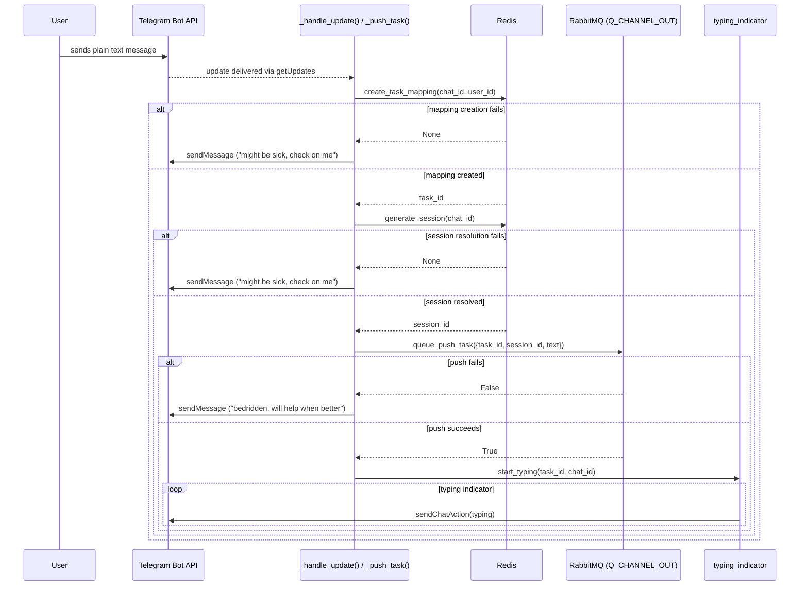
```mermaid
sequenceDiagram
    participant User
    participant TG as Telegram Bot API
    participant Handler as _handle_update() / _push_task()
    participant Redis
    participant MQ as RabbitMQ (Q_CHANNEL_OUT)
    participant Typing as typing_indicator

    User->>TG: sends plain text message
    TG-->>Handler: update delivered via getUpdates
    Handler->>Redis: create_task_mapping(chat_id, user_id)
    alt mapping creation fails
        Redis-->>Handler: None
        Handler->>TG: sendMessage ("might be sick, check on me")
    else mapping created
        Redis-->>Handler: task_id
        Handler->>Redis: generate_session(chat_id)
        alt session resolution fails
            Redis-->>Handler: None
            Handler->>TG: sendMessage ("might be sick, check on me")
        else session resolved
            Redis-->>Handler: session_id
            Handler->>MQ: queue_push_task({task_id, session_id, text})
            alt push fails
                MQ-->>Handler: False
                Handler->>TG: sendMessage ("bedridden, will help when better")
            else push succeeds
                MQ-->>Handler: True
                Handler->>Typing: start_typing(task_id, chat_id)
                loop typing indicator
                    Typing->>TG: sendChatAction(typing)
                end
            end
        end
    end
```

---

## 4. Media & Draft Handling

### 4.1 – 4.3 New media received (draft creation)

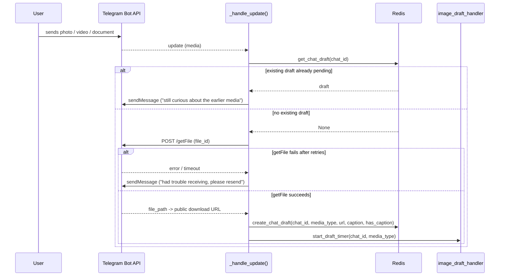
```mermaid
sequenceDiagram
    participant User
    participant TG as Telegram Bot API
    participant Gateway as _handle_update()
    participant Redis
    participant DraftTimer as image_draft_handler

    User->>TG: sends photo / video / document
    TG-->>Gateway: update (media)
    Gateway->>Redis: get_chat_draft(chat_id)
    alt existing draft already pending
        Redis-->>Gateway: draft
        Gateway->>TG: sendMessage ("still curious about the earlier media")
    else no existing draft
        Redis-->>Gateway: None
        Gateway->>TG: POST /getFile (file_id)
        alt getFile fails after retries
            TG-->>Gateway: error / timeout
            Gateway->>TG: sendMessage ("had trouble receiving, please resend")
        else getFile succeeds
            TG-->>Gateway: file_path -> public download URL
            Gateway->>Redis: create_chat_draft(chat_id, media_type, url, caption, has_caption)
            Gateway->>DraftTimer: start_draft_timer(chat_id, media_type)
        end
    end
```

### 4.4 Draft finalisation (text arrives while draft pending)

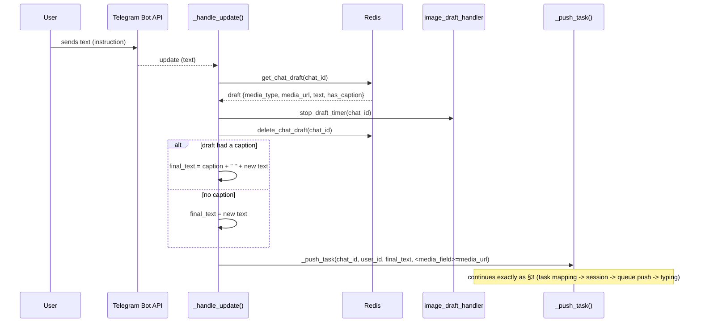
```mermaid
sequenceDiagram
    participant User
    participant TG as Telegram Bot API
    participant Gateway as _handle_update()
    participant Redis
    participant DraftTimer as image_draft_handler
    participant Push as _push_task()

    User->>TG: sends text (instruction)
    TG-->>Gateway: update (text)
    Gateway->>Redis: get_chat_draft(chat_id)
    Redis-->>Gateway: draft {media_type, media_url, text, has_caption}
    Gateway->>DraftTimer: stop_draft_timer(chat_id)
    Gateway->>Redis: delete_chat_draft(chat_id)
    alt draft had a caption
        Gateway->>Gateway: final_text = caption + " " + new text
    else no caption
        Gateway->>Gateway: final_text = new text
    end
    Gateway->>Push: _push_task(chat_id, user_id, final_text, <media_field>=media_url)
    Note over Push: continues exactly as §3 (task mapping -> session -> queue push -> typing)
```

### 4.5 – 4.8 Draft keep-alive cycle (notice / continue button / expiry)

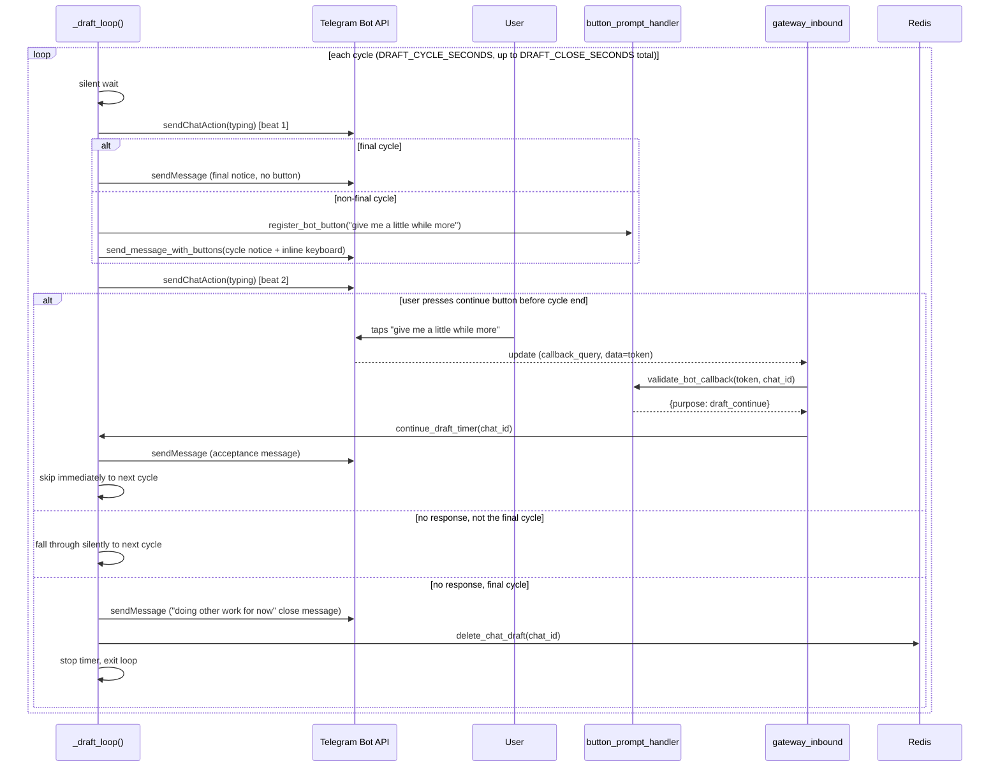
```mermaid
sequenceDiagram
    participant DraftLoop as _draft_loop()
    participant TG as Telegram Bot API
    participant User
    participant Button as button_prompt_handler
    participant Gateway as gateway_inbound
    participant Redis

    loop each cycle (DRAFT_CYCLE_SECONDS, up to DRAFT_CLOSE_SECONDS total)
        DraftLoop->>DraftLoop: silent wait
        DraftLoop->>TG: sendChatAction(typing) [beat 1]
        alt final cycle
            DraftLoop->>TG: sendMessage (final notice, no button)
        else non-final cycle
            DraftLoop->>Button: register_bot_button("give me a little while more")
            DraftLoop->>TG: send_message_with_buttons(cycle notice + inline keyboard)
        end
        DraftLoop->>TG: sendChatAction(typing) [beat 2]
        alt user presses continue button before cycle end
            User->>TG: taps "give me a little while more"
            TG-->>Gateway: update (callback_query, data=token)
            Gateway->>Button: validate_bot_callback(token, chat_id)
            Button-->>Gateway: {purpose: draft_continue}
            Gateway->>DraftLoop: continue_draft_timer(chat_id)
            DraftLoop->>TG: sendMessage (acceptance message)
            DraftLoop->>DraftLoop: skip immediately to next cycle
        else no response, not the final cycle
            DraftLoop->>DraftLoop: fall through silently to next cycle
        else no response, final cycle
            DraftLoop->>TG: sendMessage ("doing other work for now" close message)
            DraftLoop->>Redis: delete_chat_draft(chat_id)
            DraftLoop->>DraftLoop: stop timer, exit loop
        end
    end
```

### 4.9 Orphaned draft recovery on startup

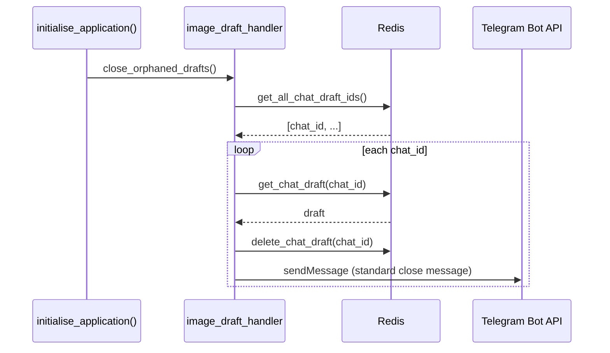
```mermaid
sequenceDiagram
    participant Init as initialise_application()
    participant DraftMod as image_draft_handler
    participant Redis
    participant TG as Telegram Bot API

    Init->>DraftMod: close_orphaned_drafts()
    DraftMod->>Redis: get_all_chat_draft_ids()
    Redis-->>DraftMod: [chat_id, ...]
    loop each chat_id
        DraftMod->>Redis: get_chat_draft(chat_id)
        Redis-->>DraftMod: draft
        DraftMod->>Redis: delete_chat_draft(chat_id)
        DraftMod->>TG: sendMessage (standard close message)
    end
```

### 4.10 Album (media_group_id) handling

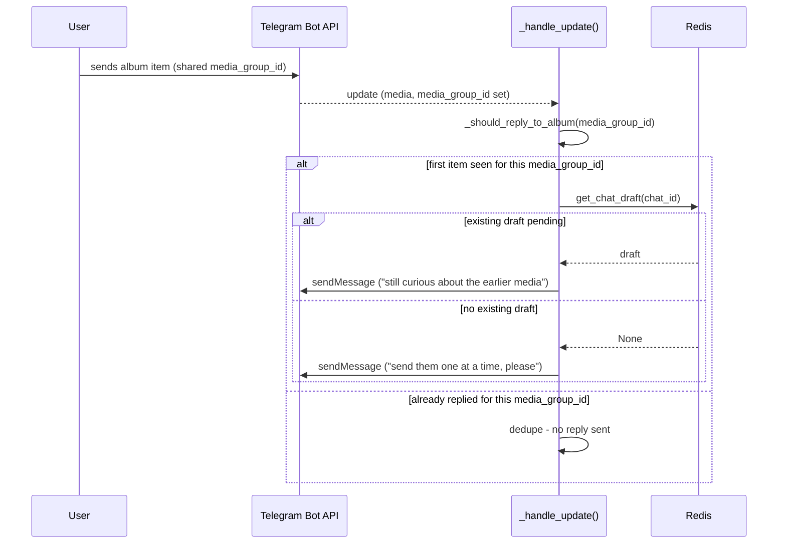
```mermaid
sequenceDiagram
    participant User
    participant TG as Telegram Bot API
    participant Gateway as _handle_update()
    participant Redis

    User->>TG: sends album item (shared media_group_id)
    TG-->>Gateway: update (media, media_group_id set)
    Gateway->>Gateway: _should_reply_to_album(media_group_id)
    alt first item seen for this media_group_id
        Gateway->>Redis: get_chat_draft(chat_id)
        alt existing draft pending
            Redis-->>Gateway: draft
            Gateway->>TG: sendMessage ("still curious about the earlier media")
        else no existing draft
            Redis-->>Gateway: None
            Gateway->>TG: sendMessage ("send them one at a time, please")
        end
    else already replied for this media_group_id
        Gateway->>Gateway: dedupe - no reply sent
    end
```

---

## 5. Callback Query (Inline Button) Handling

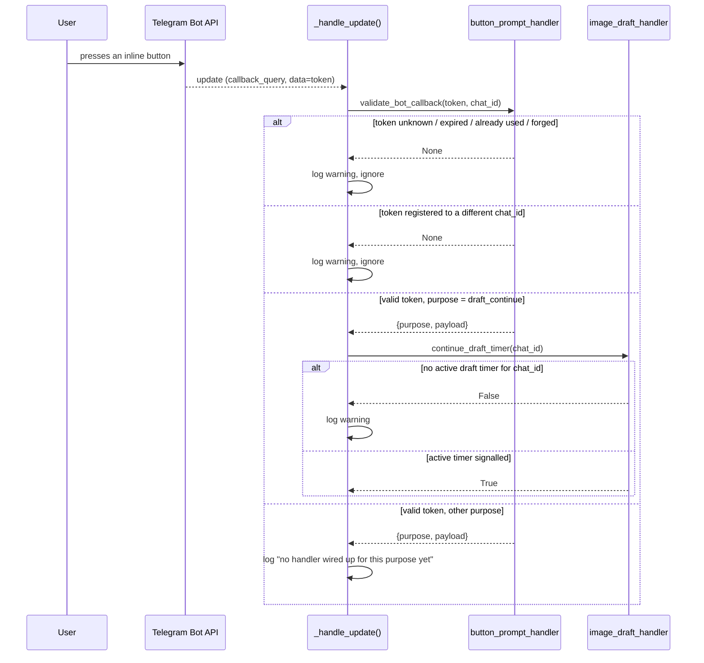
```mermaid
sequenceDiagram
    participant User
    participant TG as Telegram Bot API
    participant Gateway as _handle_update()
    participant Button as button_prompt_handler
    participant DraftTimer as image_draft_handler

    User->>TG: presses an inline button
    TG-->>Gateway: update (callback_query, data=token)
    Gateway->>Button: validate_bot_callback(token, chat_id)
    alt token unknown / expired / already used / forged
        Button-->>Gateway: None
        Gateway->>Gateway: log warning, ignore
    else token registered to a different chat_id
        Button-->>Gateway: None
        Gateway->>Gateway: log warning, ignore
    else valid token, purpose = draft_continue
        Button-->>Gateway: {purpose, payload}
        Gateway->>DraftTimer: continue_draft_timer(chat_id)
        alt no active draft timer for chat_id
            DraftTimer-->>Gateway: False
            Gateway->>Gateway: log warning
        else active timer signalled
            DraftTimer-->>Gateway: True
        end
    else valid token, other purpose
        Button-->>Gateway: {purpose, payload}
        Gateway->>Gateway: log "no handler wired up for this purpose yet"
    end
```

---

## 6. Outbound Message Dispatch (from RabbitMQ)

### 6.1 `text` payload (with optional buttons)

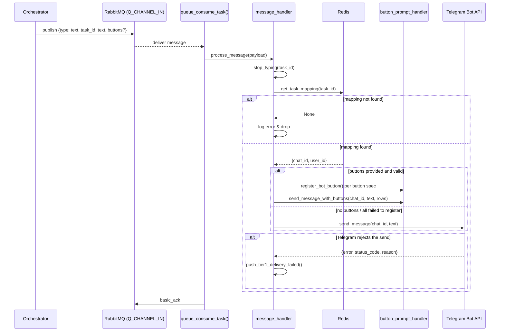
```mermaid
sequenceDiagram
    participant Orchestrator
    participant MQ as RabbitMQ (Q_CHANNEL_IN)
    participant Consumer as queue_consume_task()
    participant Handler as message_handler
    participant Redis
    participant Button as button_prompt_handler
    participant TG as Telegram Bot API

    Orchestrator->>MQ: publish {type: text, task_id, text, buttons?}
    MQ-->>Consumer: deliver message
    Consumer->>Handler: process_message(payload)
    Handler->>Handler: stop_typing(task_id)
    Handler->>Redis: get_task_mapping(task_id)
    alt mapping not found
        Redis-->>Handler: None
        Handler->>Handler: log error & drop
    else mapping found
        Redis-->>Handler: {chat_id, user_id}
        alt buttons provided and valid
            Handler->>Button: register_bot_button() per button spec
            Handler->>Button: send_message_with_buttons(chat_id, text, rows)
        else no buttons / all failed to register
            Handler->>TG: send_message(chat_id, text)
        end
        alt Telegram rejects the send
            TG-->>Handler: {error, status_code, reason}
            Handler->>Handler: push_tier1_delivery_failed()
        end
    end
    Consumer->>MQ: basic_ack
```

### 6.2 `image` / `video` / `file` payload (caption overflow split)

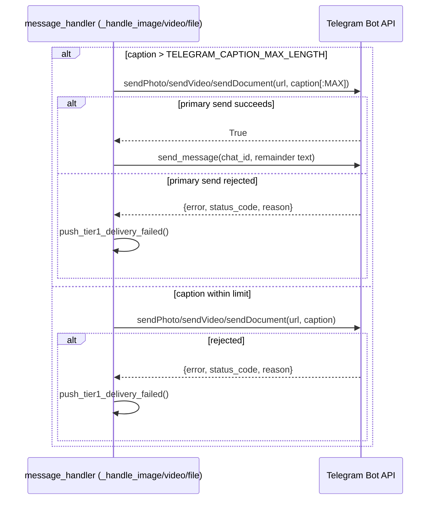
```mermaid
sequenceDiagram
    participant Handler as message_handler (_handle_image/video/file)
    participant TG as Telegram Bot API

    alt caption > TELEGRAM_CAPTION_MAX_LENGTH
        Handler->>TG: sendPhoto/sendVideo/sendDocument(url, caption[:MAX])
        alt primary send succeeds
            TG-->>Handler: True
            Handler->>TG: send_message(chat_id, remainder text)
        else primary send rejected
            TG-->>Handler: {error, status_code, reason}
            Handler->>Handler: push_tier1_delivery_failed()
        end
    else caption within limit
        Handler->>TG: sendPhoto/sendVideo/sendDocument(url, caption)
        alt rejected
            TG-->>Handler: {error, status_code, reason}
            Handler->>Handler: push_tier1_delivery_failed()
        end
    end
```

### 6.3 `album` payload

```mermaid
sequenceDiagram
    participant Handler as message_handler (_handle_album)
    participant TG as Telegram Bot API

    alt items missing / not a list / contains invalid item
        Handler->>Handler: log error & drop
    else more than 10 items
        loop each chunk of up to 10
            Handler->>Handler: _send_album_chunk(chunk)
        end
    else 1-10 items
        Handler->>Handler: _send_album_chunk(items)
    end
    Note over Handler,TG: _send_album_chunk(): 1 item -> sendPhoto/sendVideo; 2-10 -> sendMediaGroup
    alt Telegram rejects the chunk
        TG-->>Handler: {error, status_code, reason}
        Handler->>Handler: push_tier1_delivery_failed(attempted_type="album")
    end
```

### 6.4 `poll` payload

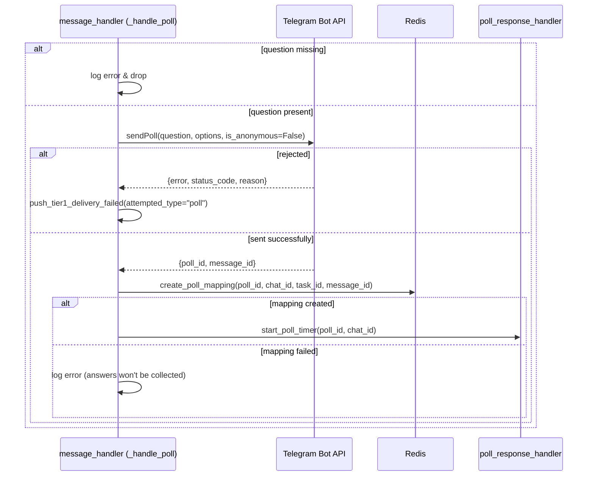
```mermaid
sequenceDiagram
    participant Handler as message_handler (_handle_poll)
    participant TG as Telegram Bot API
    participant Redis
    participant PollTimer as poll_response_handler

    alt question missing
        Handler->>Handler: log error & drop
    else question present
        Handler->>TG: sendPoll(question, options, is_anonymous=False)
        alt rejected
            TG-->>Handler: {error, status_code, reason}
            Handler->>Handler: push_tier1_delivery_failed(attempted_type="poll")
        else sent successfully
            TG-->>Handler: {poll_id, message_id}
            Handler->>Redis: create_poll_mapping(poll_id, chat_id, task_id, message_id)
            alt mapping created
                Handler->>PollTimer: start_poll_timer(poll_id, chat_id)
            else mapping failed
                Handler->>Handler: log error (answers won't be collected)
            end
        end
    end
```

### 6.5 – 6.8 `completed` / `error` / `session_reset` markers

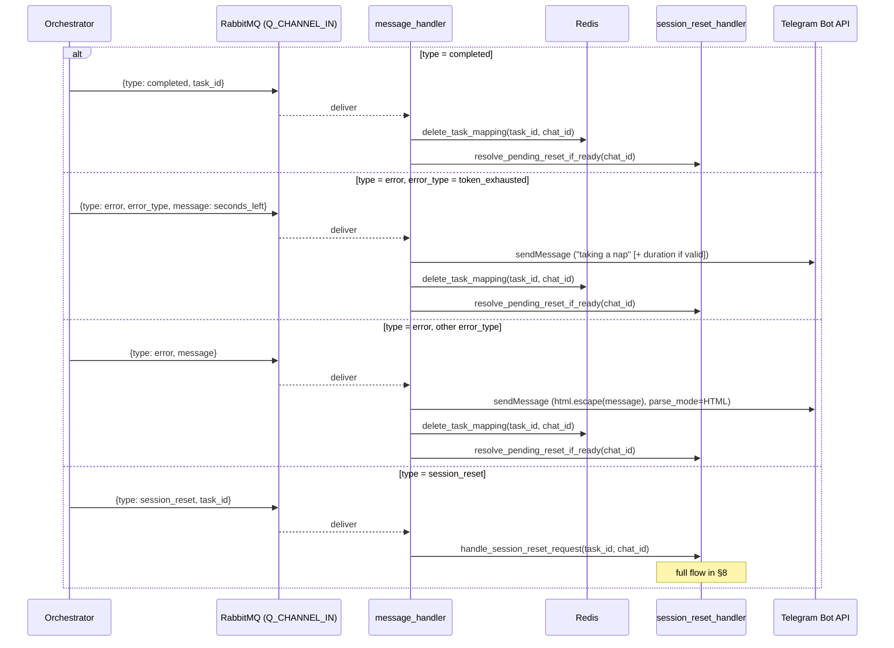
```mermaid
sequenceDiagram
    participant Orchestrator
    participant MQ as RabbitMQ (Q_CHANNEL_IN)
    participant Handler as message_handler
    participant Redis
    participant Session as session_reset_handler
    participant TG as Telegram Bot API

    alt type = completed
        Orchestrator->>MQ: {type: completed, task_id}
        MQ-->>Handler: deliver
        Handler->>Redis: delete_task_mapping(task_id, chat_id)
        Handler->>Session: resolve_pending_reset_if_ready(chat_id)
    else type = error, error_type = token_exhausted
        Orchestrator->>MQ: {type: error, error_type, message: seconds_left}
        MQ-->>Handler: deliver
        Handler->>TG: sendMessage ("taking a nap" [+ duration if valid])
        Handler->>Redis: delete_task_mapping(task_id, chat_id)
        Handler->>Session: resolve_pending_reset_if_ready(chat_id)
    else type = error, other error_type
        Orchestrator->>MQ: {type: error, message}
        MQ-->>Handler: deliver
        Handler->>TG: sendMessage (html.escape(message), parse_mode=HTML)
        Handler->>Redis: delete_task_mapping(task_id, chat_id)
        Handler->>Session: resolve_pending_reset_if_ready(chat_id)
    else type = session_reset
        Orchestrator->>MQ: {type: session_reset, task_id}
        MQ-->>Handler: deliver
        Handler->>Session: handle_session_reset_request(task_id, chat_id)
        Note over Session: full flow in §8
    end
```

### 6.9 – 6.12 Malformed payloads & consumer-level failure handling

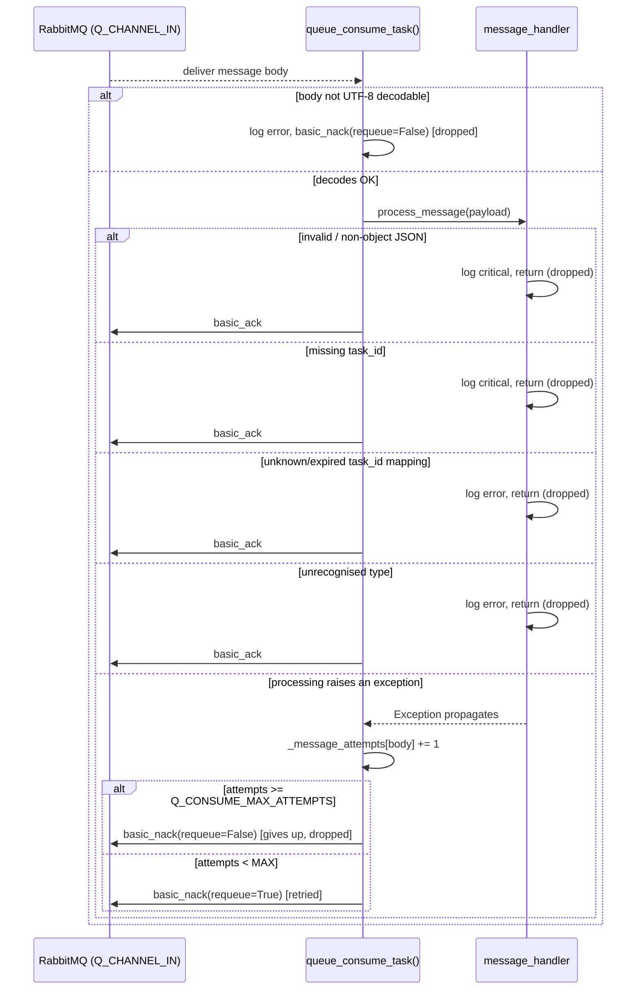
```mermaid
sequenceDiagram
    participant MQ as RabbitMQ (Q_CHANNEL_IN)
    participant Consumer as queue_consume_task()
    participant Handler as message_handler

    MQ-->>Consumer: deliver message body
    alt body not UTF-8 decodable
        Consumer->>Consumer: log error, basic_nack(requeue=False) [dropped]
    else decodes OK
        Consumer->>Handler: process_message(payload)
        alt invalid / non-object JSON
            Handler->>Handler: log critical, return (dropped)
            Consumer->>MQ: basic_ack
        else missing task_id
            Handler->>Handler: log critical, return (dropped)
            Consumer->>MQ: basic_ack
        else unknown/expired task_id mapping
            Handler->>Handler: log error, return (dropped)
            Consumer->>MQ: basic_ack
        else unrecognised type
            Handler->>Handler: log error, return (dropped)
            Consumer->>MQ: basic_ack
        else processing raises an exception
            Handler-->>Consumer: Exception propagates
            Consumer->>Consumer: _message_attempts[body] += 1
            alt attempts >= Q_CONSUME_MAX_ATTEMPTS
                Consumer->>MQ: basic_nack(requeue=False) [gives up, dropped]
            else attempts < MAX
                Consumer->>MQ: basic_nack(requeue=True) [retried]
            end
        end
    end
```

---

## 7. Poll Answer Collection

### 7.1 – 7.4 Poll lifecycle: timeout, first answer, debounce, settle

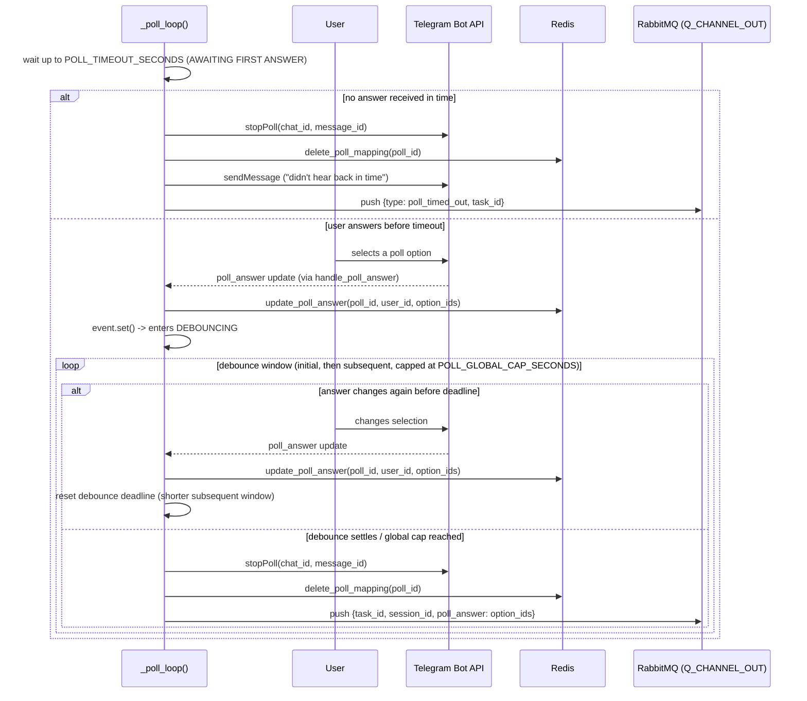
```mermaid
sequenceDiagram
    participant PollLoop as _poll_loop()
    participant User
    participant TG as Telegram Bot API
    participant Redis
    participant MQ as RabbitMQ (Q_CHANNEL_OUT)

    PollLoop->>PollLoop: wait up to POLL_TIMEOUT_SECONDS (AWAITING FIRST ANSWER)
    alt no answer received in time
        PollLoop->>TG: stopPoll(chat_id, message_id)
        PollLoop->>Redis: delete_poll_mapping(poll_id)
        PollLoop->>TG: sendMessage ("didn't hear back in time")
        PollLoop->>MQ: push {type: poll_timed_out, task_id}
    else user answers before timeout
        User->>TG: selects a poll option
        TG-->>PollLoop: poll_answer update (via handle_poll_answer)
        PollLoop->>Redis: update_poll_answer(poll_id, user_id, option_ids)
        PollLoop->>PollLoop: event.set() -> enters DEBOUNCING
        loop debounce window (initial, then subsequent, capped at POLL_GLOBAL_CAP_SECONDS)
            alt answer changes again before deadline
                User->>TG: changes selection
                TG-->>PollLoop: poll_answer update
                PollLoop->>Redis: update_poll_answer(poll_id, user_id, option_ids)
                PollLoop->>PollLoop: reset debounce deadline (shorter subsequent window)
            else debounce settles / global cap reached
                PollLoop->>TG: stopPoll(chat_id, message_id)
                PollLoop->>Redis: delete_poll_mapping(poll_id)
                PollLoop->>MQ: push {task_id, session_id, poll_answer: option_ids}
            end
        end
    end
```

### 7.5 poll_answer for unknown/closed poll

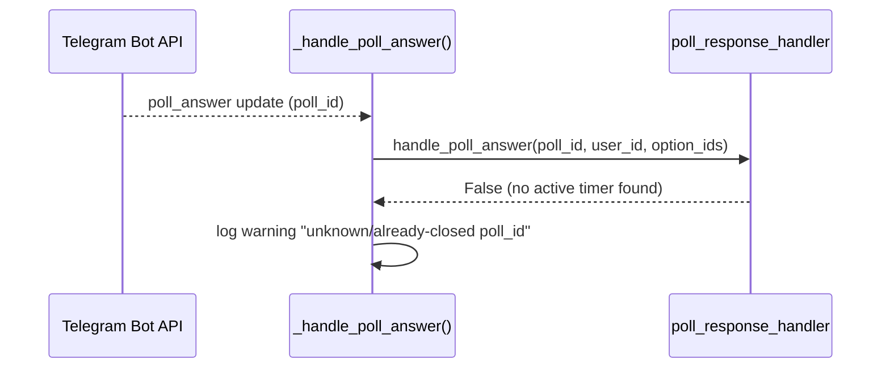
```mermaid
sequenceDiagram
    participant TG as Telegram Bot API
    participant Gateway as _handle_poll_answer()
    participant PollMod as poll_response_handler

    TG-->>Gateway: poll_answer update (poll_id)
    Gateway->>PollMod: handle_poll_answer(poll_id, user_id, option_ids)
    PollMod-->>Gateway: False (no active timer found)
    Gateway->>Gateway: log warning "unknown/already-closed poll_id"
```

### 7.6 Orphaned poll recovery on startup

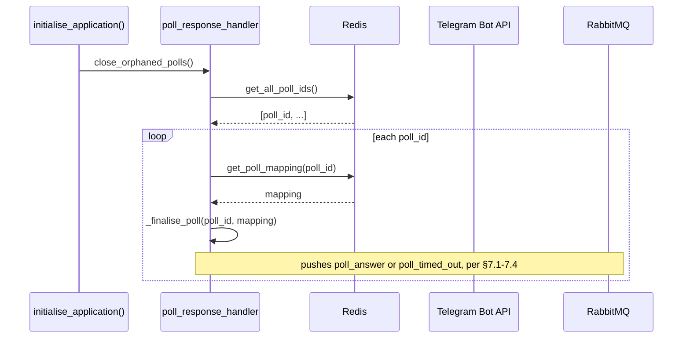
```mermaid
sequenceDiagram
    participant Init as initialise_application()
    participant PollMod as poll_response_handler
    participant Redis
    participant TG as Telegram Bot API
    participant MQ as RabbitMQ

    Init->>PollMod: close_orphaned_polls()
    PollMod->>Redis: get_all_poll_ids()
    Redis-->>PollMod: [poll_id, ...]
    loop each poll_id
        PollMod->>Redis: get_poll_mapping(poll_id)
        Redis-->>PollMod: mapping
        PollMod->>PollMod: _finalise_poll(poll_id, mapping)
        Note over PollMod,MQ: pushes poll_answer or poll_timed_out, per §7.1-7.4
    end
```

### 7.7 Poll force-closed by a session reset

```mermaid
sequenceDiagram
    participant Session as session_reset_handler
    participant PollMod as poll_response_handler
    participant TG as Telegram Bot API
    participant Redis

    Session->>PollMod: stop_poll_for_reset(poll_id)
    PollMod->>PollMod: control["stop"] = True; event.set()
    PollMod->>Redis: get_poll_mapping(poll_id)
    alt poll_id already unknown (race with natural closure)
        Redis-->>PollMod: None
        PollMod->>PollMod: no-op, return quietly
    else mapping found
        Redis-->>PollMod: mapping
        PollMod->>TG: stopPoll(chat_id, message_id)
        PollMod->>Redis: delete_poll_mapping(poll_id, chat_id)
        Note over PollMod: no answer pushed, no chat message - deliberate clean slate
    end
```

---

## 8. Session Reset Flow

### 8.1 – 8.3 Reset request: whitelist check, defer vs. immediate

```mermaid
sequenceDiagram
    participant Orchestrator
    participant MQ as RabbitMQ (Q_CHANNEL_IN)
    participant Handler as message_handler
    participant Session as session_reset_handler
    participant Redis
    participant TG as Telegram Bot API

    Orchestrator->>MQ: {type: session_reset, task_id, chat_id}
    MQ-->>Handler: deliver
    Handler->>Session: handle_session_reset_request(task_id, chat_id)
    alt chat_id not in SESSION_RESET_ALLOWED_CHAT_IDS
        Session->>Session: log warning, drop silently (no defer, no reset, no ack)
    else chat_id whitelisted
        Session->>Redis: has_open_tasks(chat_id)
        alt open task(s) exist
            Redis-->>Session: True
            Session->>Redis: set_pending_reset(chat_id, task_id)
            Note over Session: no user-facing notice sent yet
        else no open tasks
            Redis-->>Session: False
            Session->>Session: _apply_session_reset(chat_id)
            Session->>Session: stop_draft_timer(chat_id)
            Session->>Redis: reset_session(chat_id)
            Redis-->>Session: cleared_session_id
            alt session_id existed
                Session->>MQ: push {type: session_cleared, session_id, chat_id}
                Session->>TG: sendMessage (reset notice)
            else no session existed (§8.7)
                Session->>Session: no-op (nothing to clear/ack/notify)
            end
        end
    end
```

### 8.4 Deferred reset resolves naturally

```mermaid
sequenceDiagram
    participant Handler as message_handler (_handle_completed / _handle_error)
    participant Redis
    participant Session as session_reset_handler
    participant TG as Telegram Bot API
    participant MQ as RabbitMQ

    Handler->>Redis: delete_task_mapping(task_id, chat_id)
    Handler->>Session: resolve_pending_reset_if_ready(chat_id)
    Session->>Redis: get_pending_reset(chat_id)
    alt no reset pending
        Redis-->>Session: None
        Session->>Session: no-op
    else reset pending
        Redis-->>Session: task_id
        Session->>Redis: has_open_tasks(chat_id)
        alt still has open tasks
            Redis-->>Session: True
            Session->>Session: no-op (keeps waiting)
        else no open tasks left
            Redis-->>Session: False
            Session->>Redis: clear_pending_reset(chat_id)
            Session->>Session: _apply_session_reset(chat_id)
            Session->>MQ: push {type: session_cleared}
            Session->>TG: sendMessage (reset notice)
        end
    end
```

### 8.5 Ceiling sweep force-applies an overdue reset

```mermaid
sequenceDiagram
    participant Sweep as _pending_reset_ceiling_loop()
    participant Session as session_reset_handler
    participant Redis
    participant PollMod as poll_response_handler
    participant TG as Telegram Bot API
    participant MQ as RabbitMQ

    loop every PENDING_RESET_SWEEP_INTERVAL_SECONDS
        Sweep->>Session: enforce_pending_reset_ceiling()
        Session->>Redis: get_all_pending_resets()
        Redis-->>Session: [(chat_id, task_id, created_at), ...]
        loop each pending reset
            alt age < PENDING_RESET_MAX_WAIT_SECONDS
                Session->>Session: skip (still within grace period)
            else expired
                Session->>Redis: clear_pending_reset(chat_id)
                Session->>Redis: get_session_poll_ids(chat_id)
                loop each still-open poll_id (defensive)
                    Session->>PollMod: stop_poll_for_reset(poll_id)
                end
                Session->>Session: _apply_session_reset(chat_id)
                Session->>MQ: push {type: session_cleared}
                Session->>TG: sendMessage (reset notice)
                Session->>Session: log warning (force-applied)
            end
        end
    end
```

### 8.6 Startup resync of deferred resets

```mermaid
sequenceDiagram
    participant Init as initialise_application()
    participant Session as session_reset_handler
    participant Redis
    participant TG as Telegram Bot API
    participant MQ as RabbitMQ

    Init->>Session: resync_pending_resets()
    Session->>Redis: get_all_pending_resets()
    Redis-->>Session: [(chat_id, task_id, created_at), ...]
    loop each pending reset
        Session->>Redis: has_open_tasks(chat_id)
        alt still open, not yet expired
            Session->>Session: leave untouched in Redis (no TTL)
        else still open, already expired
            Session->>Session: _force_apply_session_reset(chat_id, task_id)
        else no open tasks (resolvable now)
            Session->>Redis: clear_pending_reset(chat_id)
            Session->>Session: _apply_session_reset(chat_id)
            Session->>MQ: push {type: session_cleared}
            Session->>TG: sendMessage (reset notice)
        end
    end
```

### 8.7 Reset applied where no session ever existed

```mermaid
sequenceDiagram
    participant Session as _apply_session_reset()
    participant Redis
    participant MQ as RabbitMQ
    participant TG as Telegram Bot API

    Session->>Session: stop_draft_timer(chat_id)
    Session->>Redis: reset_session(chat_id)
    alt no session_id existed for chat_id
        Redis-->>Session: None
        Session->>Session: no-op (no ack, no notice)
    else session existed
        Redis-->>Session: cleared_session_id
        Session->>MQ: push {type: session_cleared, session_id}
        Session->>TG: sendMessage (reset notice)
    end
```

---

## 9. Typing Indicator

```mermaid
sequenceDiagram
    participant Push as _push_task() / message_handler
    participant TypingLoop as _typing_loop()
    participant TG as Telegram Bot API

    Push->>TypingLoop: start_typing(task_id, chat_id)
    loop until stopped or ping cap reached
        TypingLoop->>TG: sendChatAction(typing)
        alt ping cap (randomised) reached
            TypingLoop->>TypingLoop: self-terminate, remove from registry (ghost-task protection)
        else response for task_id arrives
            Push->>TypingLoop: stop_typing(task_id)
            TypingLoop->>TypingLoop: event.set() -> loop exits
        else neither yet
            TypingLoop->>TypingLoop: wait a randomised jittered interval, loop again
        end
    end
    Note over TypingLoop: Draft keep-alive typing uses a distinct key ("draft:<chat_id>") - see §4.5-4.8
```

---

## 10. Error Handling / Delivery Failure Tiers

### 10.1 – 10.4 Tier 2 (systemic) failure classification and alerting

```mermaid
sequenceDiagram
    participant SendFn as gateway_outbound.send_*()
    participant TG as Telegram Bot API
    participant ErrorMod as error_handling.py
    participant MQ as RabbitMQ

    SendFn->>TG: POST (any Telegram Bot API call)
    alt success
        TG-->>SendFn: 200 OK
        SendFn->>ErrorMod: record_send_success()
        ErrorMod->>ErrorMod: consecutive_failures = 0; re-arm alert
    else 401 Unauthorized / 404 Not Found
        TG-->>SendFn: 401 / 404
        SendFn->>ErrorMod: record_send_failure("unauthorized"/"not_found", status_code)
        alt alert currently armed
            ErrorMod->>MQ: push {type: gateway_alert, tier: 2} (fires immediately)
            ErrorMod->>ErrorMod: disarm alert
        else already disarmed (prior incident still active)
            ErrorMod->>ErrorMod: no-op
        end
    else connection/timeout exhausted after retries
        TG-->>SendFn: ConnectionError / Timeout (all attempts failed)
        SendFn->>ErrorMod: record_send_failure("unreachable")
        ErrorMod->>ErrorMod: consecutive_failures += 1
        alt consecutive_failures >= GATEWAY_ALERT_FAILURE_THRESHOLD and armed
            ErrorMod->>MQ: push {type: gateway_alert, tier: 2}
            ErrorMod->>ErrorMod: disarm alert
        else below threshold or already disarmed
            ErrorMod->>ErrorMod: no-op
        end
    else other rejection (e.g. 400 bad request)
        TG-->>SendFn: 4xx (not 401/404)
        SendFn->>SendFn: return {error: True, status_code, reason}
        Note over SendFn: caller reports this as Tier 1 - see 10.5 below
    end
```

### 10.5 Tier 1 (per-task) delivery-failure push

```mermaid
sequenceDiagram
    participant Handler as message_handler
    participant ErrorMod as error_handling.py
    participant Redis
    participant MQ as RabbitMQ (Q_CHANNEL_OUT)

    Handler->>ErrorMod: push_tier1_delivery_failed(task_id, attempted_type, status_code, reason)
    ErrorMod->>Redis: generate_session(task_id=task_id)
    alt session resolution fails
        Redis-->>ErrorMod: None
        ErrorMod->>ErrorMod: log error, event dropped
    else session resolved
        Redis-->>ErrorMod: session_id
        ErrorMod->>MQ: push {type: delivery_failed, tier: 1, task_id, attempted_type, status_code, reason}
        alt push fails
            MQ-->>ErrorMod: False
            ErrorMod->>ErrorMod: log error, event dropped
        end
    end
```

---

## 11. Connection & Infrastructure Resilience

### 11.1 RabbitMQ publish retry

```mermaid
sequenceDiagram
    participant Caller as queue_push_task()
    participant MQ as RabbitMQ

    loop attempt 1..Q_PUSH_MAX_ATTEMPTS
        Caller->>MQ: basic_publish(payload)
        alt UnroutableError (misconfigured queue/binding)
            MQ-->>Caller: UnroutableError
            Caller->>Caller: log error, return False (not retried)
        else connection-level failure
            MQ-->>Caller: AMQPConnectionError / StreamLostError / ChannelClosed
            Caller->>Caller: log warning, sleep(Q_PUSH_RETRY_DELAY), retry
        else success
            MQ-->>Caller: publish confirmed
            Caller->>Caller: return True
        end
    end
    Caller->>Caller: attempts exhausted -> log error, return False
```

### 11.2 RabbitMQ consumer reconnect

```mermaid
sequenceDiagram
    participant Consumer as queue_consume_task()
    participant MQ as RabbitMQ

    loop while _consumer_running
        Consumer->>MQ: basic_consume() / start_consuming()
        alt connection lost
            MQ-->>Consumer: AMQPConnectionError / StreamLostError
            Consumer->>Consumer: log warning, sleep(Q_CONSUME_RETRY_DELAY)
            Consumer->>Consumer: loop -> reconnect
        else unexpected exception
            MQ-->>Consumer: Exception
            Consumer->>Consumer: log exception, sleep, retry
        end
    end
```

### 11.3 – 11.4 Redis read/write retry and open-task fail-safe

```mermaid
sequenceDiagram
    participant Caller as database.py (get/create/delete)
    participant Redis

    loop attempt 1..REDIS_TASK_MAX_ATTEMPTS
        Caller->>Redis: GET / SET / DEL key
        alt transient exception raised
            Redis-->>Caller: Exception
            Caller->>Caller: log warning, sleep(REDIS_TASK_RETRY_DELAY), retry
        else key missing (no exception, e.g. expired/unknown)
            Redis-->>Caller: nil
            Caller->>Caller: log warning "not found" (NOT retried), return None
        else stored value is corrupt JSON
            Redis-->>Caller: malformed value
            Caller->>Caller: log error (NOT retried), return None
        else success
            Redis-->>Caller: value
            Caller->>Caller: return parsed value
        end
    end
    Caller->>Caller: attempts exhausted -> log exception, return None/False

    Note over Caller,Redis: has_open_tasks() specifically defaults to True (defer) on failure - never False, so an uncertain read can only delay a reset
```

### 11.5 Per-chat lock serialising task/poll creation against session reset

```mermaid
sequenceDiagram
    participant TaskCreate as create_task_mapping() / create_poll_mapping()
    participant ResetFn as reset_session()
    participant Lock as per-chat_id Lock
    participant Redis

    par concurrent operations for the same chat_id
        TaskCreate->>Lock: acquire(chat_id)
        TaskCreate->>Redis: write task/poll + sadd into session_tasks/session_polls
        TaskCreate->>Lock: release
    and
        ResetFn->>Lock: acquire(chat_id)
        ResetFn->>Redis: read session_tasks, delete each task, delete session
        ResetFn->>Lock: release
    end
    Note over Lock: serialised - prevents a task/poll being written+indexed after reset_session() already read the index, escaping deletion while its index entry is destroyed regardless
```

---

## 12. Security / Data Hygiene

### 12.1 Bot token redaction in logs

```mermaid
sequenceDiagram
    participant SendFn as gateway_outbound.*
    participant Log as log_sanitised_exception()
    participant Disk as Log File

    SendFn->>SendFn: requests exception raised (URL embeds bot token)
    SendFn->>Log: log_sanitised_exception(context_message)
    Log->>Log: traceback.format_exc().replace(TOKEN, "***REDACTED***")
    Log->>Disk: write redacted log line
```

### 12.2 PII-safe update logging

```mermaid
sequenceDiagram
    participant Gateway as poll_updates()
    participant Summary as _summarise_update()
    participant Disk as Log File

    Gateway->>Summary: _summarise_update(update)
    Summary-->>Gateway: {update_id, event_type}
    Gateway->>Disk: log summary only - never the raw update (avoids leaking sender PII / message content)
```

### 12.3 HTML-escaping untrusted agent-supplied error text

```mermaid
sequenceDiagram
    participant Handler as _handle_error()
    participant Escape as html.escape()
    participant TG as Telegram Bot API

    Handler->>Escape: html.escape(agent_supplied_message)
    Escape-->>Handler: safe_text
    Handler->>TG: sendMessage(chat_id, "<b>Error:</b> " + safe_text, parse_mode="HTML")
```

---

*Generated from a full read-through of `telegram_gateway/telegram_gateway_application/` (main.py, config.py, utilities/*).*
