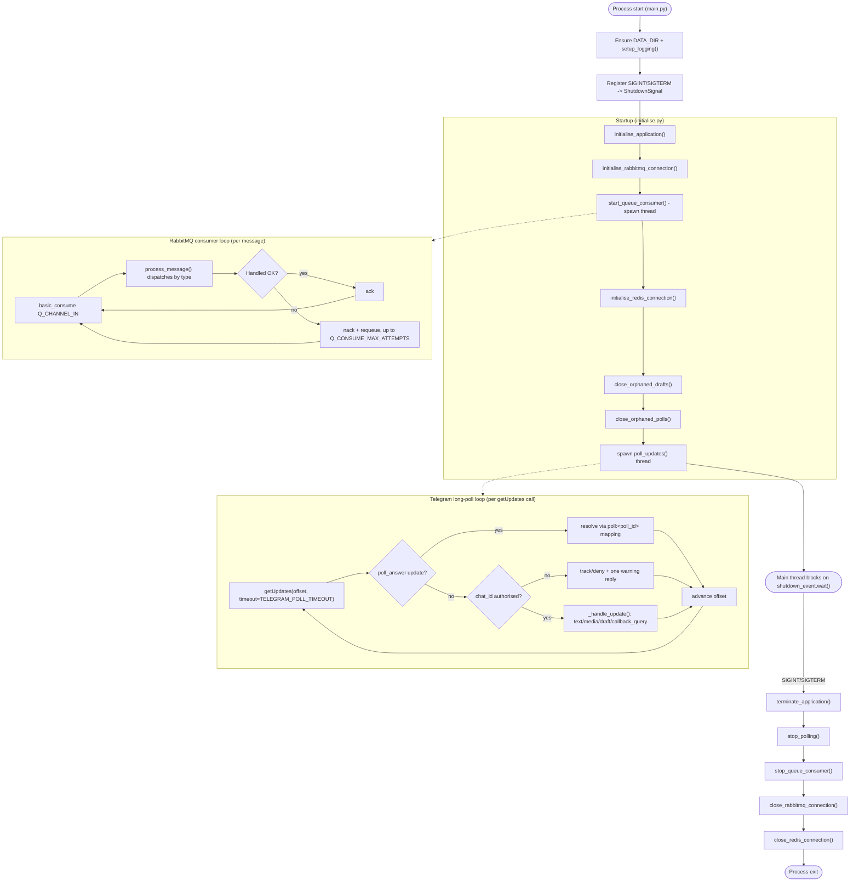

# Telegram Gateway

The Telegram Gateway is the sole interface between the Telegram Bot API and the rest of the AI agent system.
It translates Telegram messages and inline keyboard button interactions into internal queue messages (and vice versa), so no other container talks to Telegram directly.
It is also responsible for rendering inline keyboard buttons (Accept / Reject / Request Revision, mode selection) and for triggering the user's global session reset.

All application code runs inside a Docker container - there is no standalone (non-Docker) execution path.

## Infrastructure
Python application root is located at
```
telegram_gateway/telegram_gateway_application
```
- Python 3.12 (`python:3.12.4-slim` base image)
- Runs as a Docker container on the project's isolated bridge network (`chatbot-app-network`)
- Depends on RabbitMQ for internal messaging (see `utils_queue/queue.py`)
- Depends on Redis for task/draft/poll state (see `utils_redis/database.py`)
- Depends on the Telegram Bot API via a bot token (see `utils_telegram/`)

### Project Structure
- `main.py` - application entry point; configures logging, registers shutdown signal handlers, and drives startup/shutdown.
- `config.py` - centralised, environment-driven application configuration (see Environment Variables below).
- `utilities/initialise.py` - startup/shutdown orchestration (`initialise_application()` / `terminate_application()`).
- `utilities/logging_setup.py` - console and rotating file logging configuration.
- `utilities/utilities.py` - shared, dependency-free helpers (e.g. `ShutdownSignal`).
- `utilities/utils_gatekeeper/` - tracks repeated access attempts from unauthorised chats.
- `utilities/utils_queue/` - RabbitMQ connection lifecycle, inbound message dispatch, and delivery-failure reporting.
- `utilities/utils_redis/` - Redis connection lifecycle and task/draft/poll state storage.
- `utilities/utils_telegram/` - Telegram Bot API integration: inbound long-polling (`gateway_inbound.py`) and outbound sends (`gateway_outbound.py`), with supporting behaviours (typing indicator, draft keep-alive, poll debounce, inline keyboard buttons) under `utils_telegram/utilities/`.
- `data/logs/` - runtime log output (rotating daily, see Logging below).

### Application Lifecycle

#### Startup
`main.py` is the entry point:
1. Ensures `DATA_DIR` exists and configures logging (`setup_logging()`).
2. Registers `SIGINT`/`SIGTERM` handlers against a shared `ShutdownSignal`.
3. Calls `initialise_application()` (`utilities/initialise.py`), which:
   - Opens the RabbitMQ publish and consume connections, then starts the RabbitMQ consumer on its own background thread.
   - Opens the Redis connection.
   - Sweeps Redis for any draft (`close_orphaned_drafts()`) or poll (`close_orphaned_polls()`) left behind by a previous run - each is closed out immediately, since their in-memory timers don't survive a restart.
   - Starts the Telegram long-polling loop (`poll_updates()`) on its own background thread.
4. The main thread then blocks on `_shutdown_event.wait()` - from this point on, the application runs entirely on background threads.

#### Runtime - two long-running loops

**RabbitMQ consumer loop** (`utils_queue/queue.py::queue_consume_task()`) - one iteration per message:
- Consumes from `Q_CHANNEL_IN` via `basic_consume`.
- Decodes the message body and passes it to `process_message()` (`utils_queue/message_handler.py`), which dispatches by `type` (poll/image/video/album/file/text/completed/error) to the matching Telegram send call.
- Acks on success.
  On failure, nacks with requeue up to `Q_CONSUME_MAX_ATTEMPTS`, then drops.
  Reconnects automatically on a connection-level failure.

**Telegram long-polling loop** (`utils_telegram/gateway_inbound.py::poll_updates()`) - one iteration per `getUpdates` call:
- Calls `getUpdates` with the current `offset` and `TELEGRAM_ALLOWED_UPDATES`, holding the connection open for up to `TELEGRAM_POLL_TIMEOUT` seconds.
- For each update returned:
  - A `poll_answer` update is routed straight to `handle_poll_answer()` - it carries no `chat_id`, so it's resolved via its own `poll:<poll_id>` Redis mapping instead of the usual authorisation check.
  - Any other update has its `chat_id`/`user_id` extracted; a `chat_id` outside `TELEGRAM_ALLOWED_CHAT_IDS` gets tracked and, on first offence, one warning reply.
  - An authorised update is routed to `_handle_update()` - callback_query validation, media/draft staging, or a finalised task pushed to `Q_CHANNEL_OUT`.
- `offset` only advances once an update is fully handled - a failing update is retried up to `TELEGRAM_UPDATE_MAX_ATTEMPTS` times, blocking the rest of that batch meanwhile.

Beyond these two loops, several short-lived per-task/per-chat background threads are spawned dynamically as needed (not part of startup) - the typing indicator (`typing_indicator.py`), the draft keep-alive cycle (`image_draft_handler.py`), and the poll answer-collection timer (`poll_response_handler.py`) - each exits on its own once its job is done.

#### Shutdown
On `SIGINT`/`SIGTERM`, the signal handler sets the shared `ShutdownSignal`, waking the blocked main thread, which calls `terminate_application()`:
1. `stop_polling()` - signals the Telegram long-polling loop to exit (may take up to `TELEGRAM_POLL_TIMEOUT + TELEGRAM_CLIENT_TIMEOUT` if a request is already in flight).
2. `stop_queue_consumer()` - signals the RabbitMQ consumer to stop.
3. `close_rabbitmq_connection()` - closes both RabbitMQ channels/connections.
4. `close_redis_connection()` - closes the Redis client.

Dynamically spawned per-task threads are daemon threads and are not explicitly joined - they die with the process rather than being waited on.

## Getting Started
The Telegram Gateway container is intended to be managed by the project's root `./setup.sh` script (run from the `server-ai-chatbot-setup` root directory) and is not typically invoked directly.
You may use the helper script, `setup.sh`, for standalone `telegram_gateway` development.

### First-Time Setup
**Step 1:** Run helper script
```bash
./setup.sh
```
**Step 2:** Select option 1 to build and run the project
```
1
```

### Running the Project
Once built, use the same helper script, run from the root directory of the `telegram_gateway` project, for day-to-day container management.
```bash
./setup.sh
```

#### Useful Docker Commands
```bash
docker ps
docker images
docker rmi <docker-image-name>
docker start <docker-container-name>
docker stop <docker-container-name>
docker restart <docker-container-name>
```

## Documentation

### Logging
- Logged to both the console (stdout) and a rotating file at `telegram_gateway_application/data/logs/telegram_gateway.log`, rotated daily at midnight (or on reaching `LOG_MAX_SIZE_MB`), retained for `LOG_RETENTION_DAYS` days.
- Format: `%(asctime)s | %(levelname)s | %(name)s | %(message)s`.
- Verbosity is controlled by `LOG_LEVEL`.

| Level | Purpose |
|---------|---------|
| DEBUG | Detailed diagnostic information, e.g. an update ignored from an already-tracked unauthorised chat. |
| INFO | Normal application events, e.g. a message sent, a task pushed, a timer started or stopped. |
| WARNING | A recoverable issue, e.g. a retried send, a first unauthorised access attempt. |
| ERROR | A single operation failed and was dropped, e.g. a malformed payload. |
| CRITICAL | A systemic failure requiring attention, e.g. a `gateway_alert`, or a failed RabbitMQ/Redis connection. |

### Design Decisions
- **Long-polling, not webhooks** - `getUpdates` is used instead of a webhook, avoiding the need for a publicly reachable inbound endpoint.
- **Identity-blind agents** - `chat_id`/`user_id` are never forwarded to downstream agents directly; a `task_id` correlates back to identity via Redis, keeping the gateway the sole holder of chat identity (a poll answer's `user_id` being the one deliberate, documented exception - see Response Queue Message Payloads below).
- **Media staged as a draft, not sent as a task immediately** - a photo/video/document arriving without a finalising instruction is held server-side as a draft, rather than forcing every upload to carry its instruction as a caption.
- **Two-tier delivery-failure reporting** - a rejected send is reported per-task (Tier 1, actionable by retrying differently) separately from a systemic outage (Tier 2, human intervention), so a consumer of `Q_CHANNEL_OUT` can distinguish "retry this differently" from "something is broken".
- **In-memory timers with a Redis backstop** - draft/poll keep-alive timers are deliberately in-memory rather than persisted/distributed, with Redis TTLs and startup sweeps (`close_orphaned_drafts()`/`close_orphaned_polls()`) as a safety net against a restart leaving state silently stuck.

### Limitations
- Only one pending draft is held per `chat_id` at a time - further media is rejected with a reminder rather than queued.
- `sendDocument` by URL only supports `.pdf`/`.zip` files (a Telegram Bot API constraint) - other file types are rejected, and multipart upload is not implemented.
- Draft/poll keep-alive progress is in-memory only - an application restart closes any in-flight draft/poll immediately rather than resuming it part-way through.
- Requires RabbitMQ and Redis to be reachable at startup; Redis, in particular, is required before Telegram polling begins.

### Environment Variables

#### Logging
| Variable | Purpose |
|-----------|---------|
| LOG_LEVEL | Root logger verbosity. |
| LOG_MAX_SIZE_MB | File size that triggers a log rotation, alongside the daily rotation. |
| LOG_RETENTION_DAYS | Number of rotated log files kept before deletion. |

#### Telegram Connectivity
| Variable | Purpose |
|-----------|---------|
| TELEGRAM_BOT_TOKEN | The bot's API token - must be set before running. |
| TELEGRAM_BOT_NAME | Persona name used in user-facing reply text. |
| TELEGRAM_API_BASE_URL | Base URL for the Telegram Bot API. |
| TELEGRAM_POLL_TIMEOUT | How long a `getUpdates` call holds the connection open awaiting new updates. |
| TELEGRAM_CLIENT_TIMEOUT | Request timeout applied on top of `TELEGRAM_POLL_TIMEOUT`/other API calls. |
| TELEGRAM_ALLOWED_CHAT_IDS | Whitelist of chat IDs permitted to interact with the bot. |
| TELEGRAM_ALLOWED_UPDATES | Update types requested from `getUpdates`. |
| TELEGRAM_UNAUTHORISED_CACHE_SIZE | Maximum number of unauthorised `chat_id`s tracked at once. |
| TELEGRAM_UNAUTHORISED_EVICTION_WINDOW_PERCENT | Portion of the tracked cache considered for eviction once full. |
| TELEGRAM_UNAUTHORISED_ACCESS_COUNT_CAP | Ceiling on the per-`chat_id` unauthorised access counter. |
| TELEGRAM_UPDATE_MAX_ATTEMPTS | Retry attempts for an update that fails to process before it is given up on. |

#### Telegram Delivery Behaviour
| Variable | Purpose |
|-----------|---------|
| TELEGRAM_TYPING_INTERVAL_MIN / TELEGRAM_TYPING_INTERVAL_MAX | Jittered interval range between "typing..." pings while a task is in progress. |
| TELEGRAM_TYPING_MAX_PINGS_MIN / TELEGRAM_TYPING_MAX_PINGS_MAX | Randomised cap range on typing pings per task, as ghost-task protection. |
| TELEGRAM_SEND_MAX_ATTEMPTS | Retry attempts for a send on connection failure/timeout. |
| TELEGRAM_SEND_RETRY_DELAY | Delay between send retry attempts. |
| TELEGRAM_CAPTION_MAX_LENGTH | Telegram's caption length cap, used to split an overlong caption into a follow-up message. |
| TELEGRAM_MESSAGE_MAX_LENGTH | Telegram's text message length cap. |
| TELEGRAM_CALLBACK_DATA_MAX_BYTES | Telegram's `callback_data` byte-length cap. |
| TELEGRAM_BUTTONS_MAX_PER_ROW | Telegram's inline keyboard row limit. |
| TELEGRAM_BUTTONS_MAX_TOTAL | Telegram's inline keyboard total button limit. |
| TELEGRAM_CALLBACK_TTL_SECONDS | How long a bot-issued button stays pressable before being treated as stale. |

#### Draft Handling
| Variable | Purpose |
|-----------|---------|
| DRAFT_CLOSE_SECONDS | Hard cap on a pending draft's total lifetime across all keep-alive cycles. |
| DRAFT_CYCLE_SECONDS | Length of one keep-alive cycle. |
| DRAFT_CYCLE_NOTICE_LEAD_SECONDS | How far before a cycle ends its keep-alive notice is sent. |
| DRAFT_TYPING_LEAD_SECONDS | How long the "typing..." indicator runs immediately before each cycle's notice/close. |
| DRAFT_MAPPING_TTL_SECONDS | Redis-side backstop TTL for a draft record, beyond the hard cap. |
| MEDIA_GROUP_DEDUPE_SECONDS | Window for deduping the "resend one at a time" reply across items of one album. |

#### Poll Handling
| Variable | Purpose |
|-----------|---------|
| TELEGRAM_POLL_ANONYMOUS | Whether polls are sent anonymously (not caller-configurable elsewhere - answers must be attributable). |
| POLL_TIMEOUT_SECONDS | How long a poll awaits its first answer before closing unanswered. |
| POLL_DEBOUNCE_INITIAL_SECONDS | Debounce window after a poll's first answer. |
| POLL_DEBOUNCE_SUBSEQUENT_SECONDS | Shortened debounce window after every further answer. |
| POLL_GLOBAL_CAP_SECONDS | Hard ceiling on a poll's total open time from creation, regardless of debounce resets. |
| POLL_MAPPING_TTL_SECONDS | Redis-side backstop TTL for a poll record, beyond the global cap. |

#### Error Handling
| Variable | Purpose |
|-----------|---------|
| GATEWAY_ALERT_FAILURE_THRESHOLD | Consecutive connection-level send failures required before a Tier 2 "unreachable" alert fires. |

#### RabbitMQ
| Variable | Purpose |
|-----------|---------|
| Q_HOST / Q_PORT / Q_VHOST | RabbitMQ connection target. |
| Q_USER / Q_PASSWORD | RabbitMQ credentials. |
| Q_CHANNEL_IN | Queue the gateway consumes inbound response tasks from. |
| Q_CHANNEL_OUT | Queue the gateway publishes tasks/events to. |
| Q_PUSH_MAX_ATTEMPTS / Q_PUSH_RETRY_DELAY | Retry behaviour when publishing a task. |
| Q_HEARTBEAT / Q_BLOCKED_CONNECTION_TIMEOUT | RabbitMQ connection health parameters. |
| Q_CONSUME_RETRY_DELAY | Delay before the consumer loop reconnects after a connection-level failure. |
| Q_CONSUME_MAX_ATTEMPTS | Retry attempts for a message that fails to process before it is dropped. |

#### Redis
| Variable | Purpose |
|-----------|---------|
| REDIS_HOST / REDIS_PORT / REDIS_DB | Redis connection target. |
| REDIS_TASK_RETRY_DELAY / REDIS_TASK_MAX_ATTEMPTS | Retry behaviour for Redis reads/writes. |
| REDIS_TASK_MAPPING_TTL_SECONDS | Expiry for a `task_id` -> `chat_id`/`user_id` mapping. |

### Task Queue Payload (gateway -> backend)

Every task the gateway pushes to RabbitMQ (`Q_CHANNEL_OUT`) shares one shape, regardless of whether it originated from plain text, a finalised draft, or a poll answer:

```json
{
  "task_id": "...",
  "text": "...",
  "image_url": "...",
  "video_url": "...",
  "file_url": "...",
  "user_id": "...",
  "poll_answer": [0, 2]
}
```

- `text`: always present, `""` if the update carried no text.
- `image_url` / `video_url` / `file_url`: at most one is ever non-empty - the other two are always `""`.
  Resolved from Telegram's `getFile` endpoint, so the URL embeds the bot token and is only guaranteed valid by Telegram for at least 1 hour - the backend should download promptly rather than persist the URL.
- `user_id`: `null` on a plain text/media task.
  Populated only on a poll answer push - see AI_AGENT_ARCHITECTURE.md for the container it's intended for (the Debate Orchestrator).
  Not intended to reach the LLM agents - the gateway itself stays identity-blind about this the same as everywhere else (see Response Queue Message Payloads below); it's on whichever downstream container consumes this queue to keep it from propagating further.
- `poll_answer`: `null`/absent on a plain text/media task.
  Populated only on a poll answer push, with the responder's selected option indices (Telegram's `option_ids`, indices into the original poll's `options`).

#### Pending drafts (media without an instruction yet)

A photo/video/document arriving **without** a caption, or with one but no further text, is not immediately turned into a task - it is staged as a Redis-backed draft (one per `chat_id` at a time) until a text update finalises it:

- Media with a caption: the caption is stored as the draft's initial text.
  The next text update is appended onto it (`caption + " " + text`) and the task is pushed immediately.
- Media with no caption: the next text update becomes the task's `text` outright, and the task is pushed immediately.
- Further media (single item or album) arriving while a draft is already pending is **not** stored - the user is reminded about the existing draft instead.
- Album items (Telegram sets `media_group_id` on each item, delivered as separate updates) are never staged as a draft - the user is asked to resend them one at a time with individual instructions.
  The reply is sent once per album, not once per item.
- Whether the finalising text still applies to the pending media (e.g. the user changed their mind) is not decided by the gateway - it always attaches the draft's media to whatever text finalises it; that judgement call is left to the backend.

**Timeout**, per draft, is a repeating keep-alive cycle rather than a single countdown (see `utils_telegram/utilities/image_draft_handler.py`).
Each cycle is `DRAFT_CYCLE_SECONDS` long (5 min by default) and has two "typing..." windows, one immediately before each of the two messages a cycle can send:
- `DRAFT_CYCLE_SECONDS - DRAFT_CYCLE_NOTICE_LEAD_SECONDS - DRAFT_TYPING_LEAD_SECONDS` into the cycle (1 min by default): a "typing..." indicator starts.
- `DRAFT_CYCLE_SECONDS - DRAFT_CYCLE_NOTICE_LEAD_SECONDS` into the cycle (2 min by default): typing stops, a notice is sent asking if the user needs more time, with a "Give me a little while more" button attached.
- `DRAFT_CYCLE_SECONDS - DRAFT_TYPING_LEAD_SECONDS` into the cycle (4 min by default): if the button still hasn't been pressed, "typing..." starts again.
- `DRAFT_CYCLE_SECONDS` into the cycle (5 min by default): typing stops.
  If the button wasn't pressed by now (and the draft wasn't finalised), the cycle simply ends and the **next** scheduled cycle begins - sending its own notice at its own 2 min mark, and so on - **unless** this was the final cycle, in which case the draft is cleared and the user is told the bot will get to it later.

The number of cycles is fixed by `DRAFT_CLOSE_SECONDS / DRAFT_CYCLE_SECONDS` (11 cycles at the defaults above, i.e. 55 min total - kept comfortably under Telegram's 1-hour file link guarantee) and runs its course regardless of whether the button is ever pressed.
Pressing the button at any point up to a cycle's end (including during the second "typing..." window) sends a short acknowledgement and **skips ahead** to the next scheduled cycle immediately, instead of waiting out the rest of the current one - it does not add extra cycles beyond the fixed total.
The final cycle's notice has no button instead, since there's no further cycle to skip ahead to - if it still isn't finalised by the end of that cycle, the draft is cleared the same way.

The keep-alive cycle above is **in-memory only** - it does not survive an application restart, though the Redis-backed draft record itself does (it has its own TTL, `DRAFT_MAPPING_TTL_SECONDS`, slightly beyond `DRAFT_CLOSE_SECONDS`, as a backstop).
Since the loop's progress isn't persisted, a restart would otherwise leave a draft silently pending with no further notices and no close message, for up to that TTL.
To avoid this, `close_orphaned_drafts()` sweeps Redis for any leftover drafts on startup, before polling resumes, and closes each one out immediately (draft deleted, close message sent) rather than attempting to resume it part-way through a cycle.

#### Poll answers

A poll (`type: "poll"`, see below) is always sent non-anonymous (`TELEGRAM_POLL_ANONYMOUS`, not caller-configurable) so an answer can be attributed to its responder.
See `utils_telegram/utilities/poll_response_handler.py`.

Unrelated chat messages **do not** interact with an open poll at all - the bot is expected to answer them independently while the poll keeps running in the background.
There is no "one poll per chat" restriction enforced by the gateway.

Each poll goes through two phases, governed by one timer:

- **Awaiting first answer** (`POLL_TIMEOUT_SECONDS`, 5 min by default): if nobody answers in time, the poll is closed with a chat message and **nothing is pushed** to the queue.
- **Debouncing**, once answered (`POLL_DEBOUNCE_INITIAL_SECONDS`, 2 min by default, shortened to `POLL_DEBOUNCE_SUBSEQUENT_SECONDS`, 1 min, on every further answer): waits for the responder to stop changing their answer before compiling and pushing the latest one - capped overall by `POLL_GLOBAL_CAP_SECONDS` (8 min by default, comfortably under Telegram's own 10 min native poll auto-close ceiling) from poll creation, regardless of how many times debouncing resets.
  No chat message is sent on this path - an answer was already collected, so there's nothing to apologise for.

Whether a closure pushes an answer to the queue depends solely on whether the poll was ever answered, not on why it's closing - a natural debounce expiry, the global cap being reached mid-debounce, and a startup orphan-sweep closure (see below) all resolve identically.

The timer above is **in-memory only** - it does not survive an application restart, though the Redis-backed poll record does (its own TTL, `POLL_MAPPING_TTL_SECONDS`, slightly beyond `POLL_GLOBAL_CAP_SECONDS`, refreshed on every answer so it always reflects the latest one).
To avoid a poll sitting open indefinitely with an uncollected answer, `close_orphaned_polls()` sweeps Redis for any leftover poll on startup, before polling resumes, and closes each one out immediately - pushing whatever answer it already has, same as any other closure path.

### Delivery Failure Events (gateway -> backend)

When a Telegram send fails, the gateway does not simply stay silent about it - it pushes one of two event types onto `Q_CHANNEL_OUT`, depending on whether the failure is specific to one task or systemic (see `utils_queue/error_handling.py`).
Both share the type discriminator convention of the other gateway -> backend payloads above.

#### `delivery_failed` (Tier 1 - per-task, actionable)

A specific send was rejected by Telegram (e.g. an invalid `parse_mode`, a malformed poll), or failed local validation before ever reaching Telegram (e.g. an oversized message, an invalid inline keyboard).
Reported per `task_id`, since the backend/orchestrator can react by retrying that same task differently - a different content type, a shorter message, and so on.

```json
{
  "task_id": "...",
  "type": "delivery_failed",
  "tier": 1,
  "attempted_type": "image | video | album | file | text | poll",
  "status_code": 400,
  "reason": "..."
}
```
- `attempted_type`: which send was attempted - `image` / `video` / `album` / `file` / `text` / `poll`.
- `status_code`: Telegram's HTTP status code, if the request reached Telegram; `null` if caught by local validation before any request was sent.
- `reason`: Telegram's own error description, or the local validation failure message.
- Never raised for a connection-level failure (unreachable/timeout) or a 401 - those carry no "wrong tool" signal for this specific task and are reported as `gateway_alert` instead.

#### `gateway_alert` (Tier 2 - systemic, not tied to any task)

Telegram is unreachable altogether (connection/timeout exhausted after `TELEGRAM_SEND_MAX_ATTEMPTS` retries), or the bot token itself is invalid/revoked (`401`/`404`).
No per-task retry or different tool fixes either - human intervention is the only useful response.

```json
{
  "task_id": null,
  "type": "gateway_alert",
  "tier": 2,
  "reason": "unreachable | unauthorized | not_found",
  "status_code": 401
}
```
- `task_id`: always `null` - this isn't about any single task.
- `reason`: `unauthorized` (a 401 was returned), `not_found` (a 404 was returned - see below), or `unreachable` (connection failed/timed out across every retry).
- `status_code`: Telegram's HTTP status code if one was returned (`401`/`404`); `null` for `unreachable`.
- `unauthorized`/`not_found` fire immediately, bypassing the threshold below.
  Every endpoint the gateway calls is a fixed, hardcoded path, so a 404 here can't mean "wrong URL" - like a 401, it means the token doesn't resolve to a real bot (deleted/revoked/malformed).
  Both are permanent config issues, not blips, so retries won't fix either.
- `unreachable` only fires once `GATEWAY_ALERT_FAILURE_THRESHOLD` (5 by default) consecutive send failures have accumulated across *all* sends - a single blip is expected noise, not a systemic signal.
- Either way, fires **once per incident**: a successful send afterwards re-arms it, so an ongoing outage doesn't spam one alert per failed message.
- Always logged at `CRITICAL` first, regardless of whether the push to `Q_CHANNEL_OUT` itself succeeds - so the alert stays visible via infra/log-based monitoring even if RabbitMQ is part of what's broken.

**Out of scope:** disk/hardware-level failures (a true application-layer gap) are not detected or reported here - they rely on infrastructure-level restart policies/monitoring instead.

### Response Queue Message Payloads

Messages consumed by the gateway from the response queue (agent -> gateway) all share a common envelope:

```json
{"task_id": "...", "type": "<type>", ...}
```

`task_id` is required on every payload and correlates back to a `chat_id`/`user_id` stored in Redis - responses never carry chat/user identity directly, keeping agents identity-blind.
`type` selects which of the payload shapes below applies.
Consuming any payload, regardless of `type`, also stops that `task_id`'s outbound "typing..." indicator if one is active (see `utils_telegram/utilities/typing_indicator.py`) - this is not itself a distinct `type`.

#### `poll`
Maps to Telegram's `sendPoll`.
```json
{
  "task_id": "...",
  "type": "poll",
  "question": "...",
  "options": ["...", "..."],
  "allows_multiple_answers": false
}
```
- `question`: 1-300 characters.
  If missing, the whole poll is dropped and logged.
- `options`: 1-12 items, each 1-100 characters.
  Null/empty entries are filtered out; the poll is sent with whatever remains.
- `is_anonymous` is not accepted here - always `TELEGRAM_POLL_ANONYMOUS` (`false` by default), not caller-configurable.
  See "Poll answers" above for how an answer is collected and pushed back.

#### `image`
Maps to Telegram's `sendPhoto`.
```json
{"task_id": "...", "type": "image", "url": "...", "caption": "..."}
```
- `caption`: optional, see caption length note below.

#### `video`
Maps to Telegram's `sendVideo`.
```json
{"task_id": "...", "type": "video", "url": "...", "caption": "..."}
```
- `caption`: optional, see caption length note below.

#### `album`
Maps to Telegram's `sendMediaGroup`.
```json
{
  "task_id": "...",
  "type": "album",
  "items": [
    {"type": "photo", "url": "..."},
    {"type": "video", "url": "..."}
  ]
}
```
- `items`: any number of entries.
  Telegram's `sendMediaGroup` only accepts 2-10 per call, so the gateway handles the edge cases automatically:
  - 1 item: sent via `sendPhoto`/`sendVideo` instead of a media group.
  - More than 10: split into multiple `sendMediaGroup` calls of up to 10 each - if the final chunk has only 1 item, it falls back the same way.
- Each item's `type` must be `photo` or `video` - photos and videos can be mixed freely.
- Each item must have a non-empty `url` and a `type` of exactly `photo` or `video` - if any item fails this, the whole album is dropped and logged rather than sending a partial/broken result.
- No caption support - Telegram sets captions per item, not accepted here.
- No inline keyboard/buttons support on this type - Telegram's `sendMediaGroup` does not accept `reply_markup` at all.

#### `file`
Maps to Telegram's `sendDocument`.
```json
{"task_id": "...", "type": "file", "url": "...", "caption": "..."}
```
- `caption`: optional, see caption length note below.
- `url` is fetched by Telegram server-side, same as `image`/`video` - **but Telegram only supports sending a document by URL for `.pdf` and `.zip` files.**
  Any other file type sent this way is rejected; a direct multipart upload would be required instead, which is not implemented.

##### Caption length (`image`/`video`/`file`)
Telegram caps captions at 1024 characters and rejects the entire send if exceeded, rather than truncating it.
The gateway handles this automatically: the caption is cut to the limit for the media send, and anything beyond that is sent as a separate follow-up `sendMessage` instead of being lost or causing the send to fail.

#### `text`
Maps to Telegram's `sendMessage`.
```json
{
  "task_id": "...",
  "type": "text",
  "text": "...",
  "buttons": [
    [
      {"text": "Accept", "purpose": "task_review", "payload": {"decision": "accept"}},
      {"text": "Reject", "purpose": "task_review", "payload": {"decision": "reject"}}
    ]
  ]
}
```
- `buttons`: optional.
  Rows of inline keyboard buttons, each `{"text": "...", "purpose": "...", "payload": {...}}`.
  - `purpose`: caller-defined tag, read back when the press is validated so the gateway knows how to route it.
  - `payload`: optional caller-defined context retrieved alongside the press.
  - Each button is registered with a bot-issued `callback_data` token (see `utils_telegram/utilities/button_prompt_handler.py`) - the agent never supplies `callback_data` directly.
  - A button that fails to register, or a keyboard that fails Telegram's size limits, is dropped; the message still sends as plain text.

#### `completed`
Terminal marker - no further payloads are expected for this `task_id`.
```json
{"task_id": "...", "type": "completed"}
```
Triggers cleanup only: deletes the `task_id` mapping from Redis (the typing indicator is already stopped for every payload, per above).

#### `error`
Signals the task ended abnormally (e.g. an agent's token budget was exhausted).
```json
{"task_id": "...", "type": "error", "error_type": "token_exhausted", "message": "300"}
```
- `error_type`: short machine-readable code. Currently recognised:
  - `token_exhausted` - sends a fixed persona message.
    `message` is reused (not a separate field) to carry `nap_duration_left` - seconds **remaining**, a countdown, not a fixed total - included in the reply if present and numeric; omitted otherwise.
  - Any other value (including `unknown`) - `message` is treated as free text and sent back to the user, wrapped in a persona-styled HTML message (Telegram `parse_mode` `HTML`, `message` is HTML-escaped before being embedded).
- Same cleanup as `completed`, plus a user-facing notification.

## Project Architecture

The diagram below traces the gateway's process lifecycle - startup, its two long-running loops, and shutdown - at a whiteboard level.


